[Download as PDF](docs/PitchGrid_MicroExquis.pdf)

[Download QuickStart Patch for VCV Rack](docs/MicroExquis_Quickstart.vcv)

#  PitchGrid MicroExquis

_Author: Peter Jung (mail@peter-jung.net)_ 
_Version: 2024-10-08_

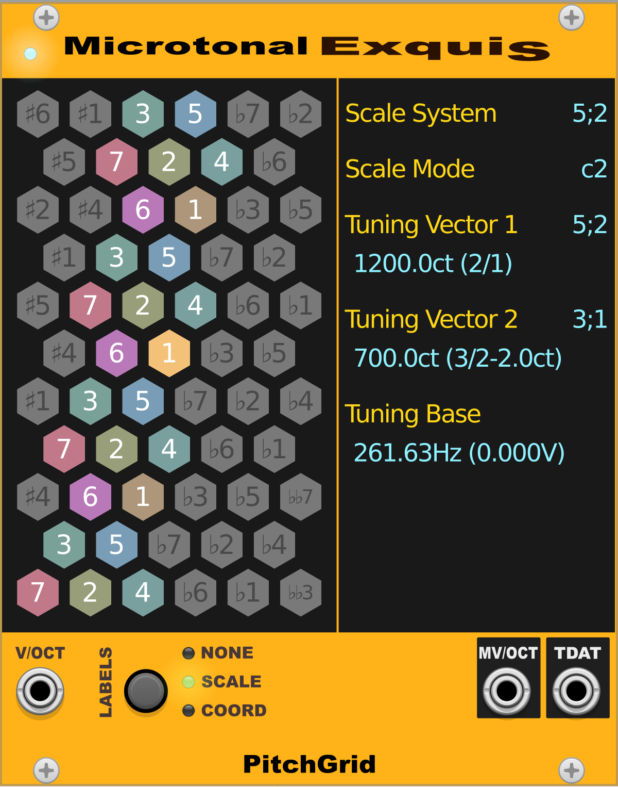

# Documentation

The PitchGrid Microtonal Exquis (or MicroExquis for short) is a module in the  [PitchGrid Rack](https://library.vcvrack.com/PitchGrid) plugin for [VCV Rack](https://vcvrack.com). VCV Rack is available as free software. The purpose of MicroExquis is to provide a means to explore different tunings, scales and hexagonal keyboard layouts via the [Exquis MPE controller by Intuitive Instruments](https://dualo.com/exquis/?utm_source=VCVplugin).

## Quickstart

**Step 1:** Connect the [Exquis](https://dualo.com/exquis/?utm_source=VCVplugin) (tested with firmware v1.2.0)

**Step 2:** Load the [MicroExquis Quickstart patch](https://pitchgrid.io/docs/MicroExquis_Quickstart.vcv). 

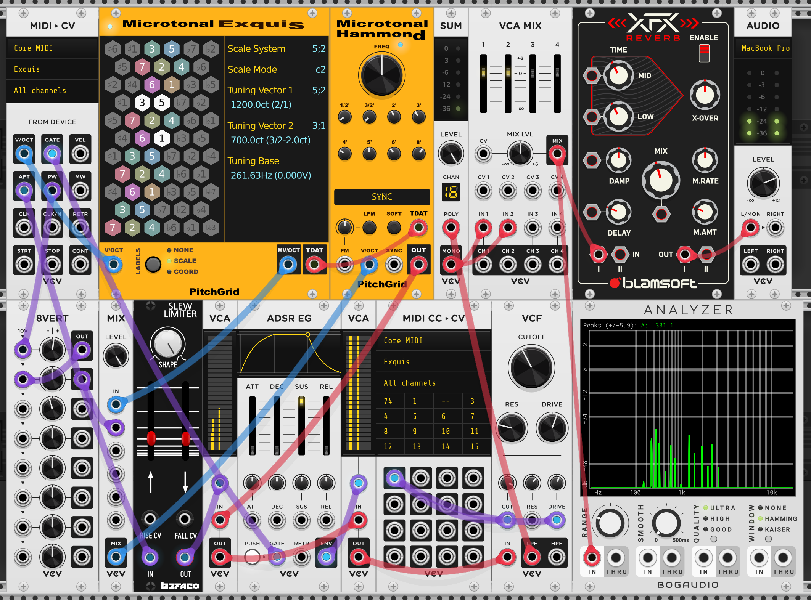

**Step 3:** Right click on the MicroExquis and load the first factory preset. 

**Step 4:** Configure the MIDI▶︎CV and the MIDI CC▶︎CV modules to receive MIDI signals from the Exquis and the Audio module to your output device.

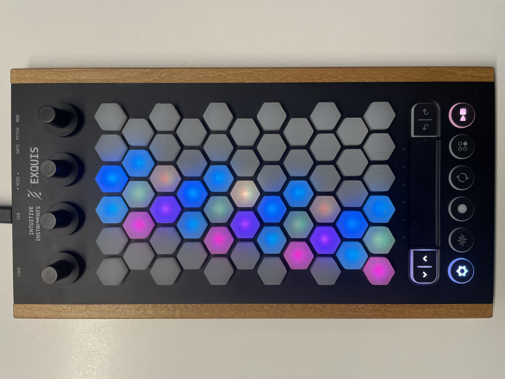

If your Exquis keys light up in the same pattern as shown on the MicroExquis module, you are all set and can start playing.

## Intro Tutorial
In MicroExquis, the note layout and features are different from the official Exquis App. The focus is on making exploration of scales beyond Western music easy. 

In the following we introduce the features of the MicroExquis.

Press the third controller at the top of your Exquis to change the coloring scheme. There are two coloring schemes available. 

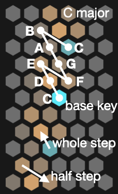

The bright blue note in the middle is the base note, C. The darker blue keys are octaves below and above. The yellow keys in between are notes of the selected scale. Their brighness decreases with increasing position in the scale. In the current layout, a whole step is one key up-left and a half step is a key right and a key down-right. 

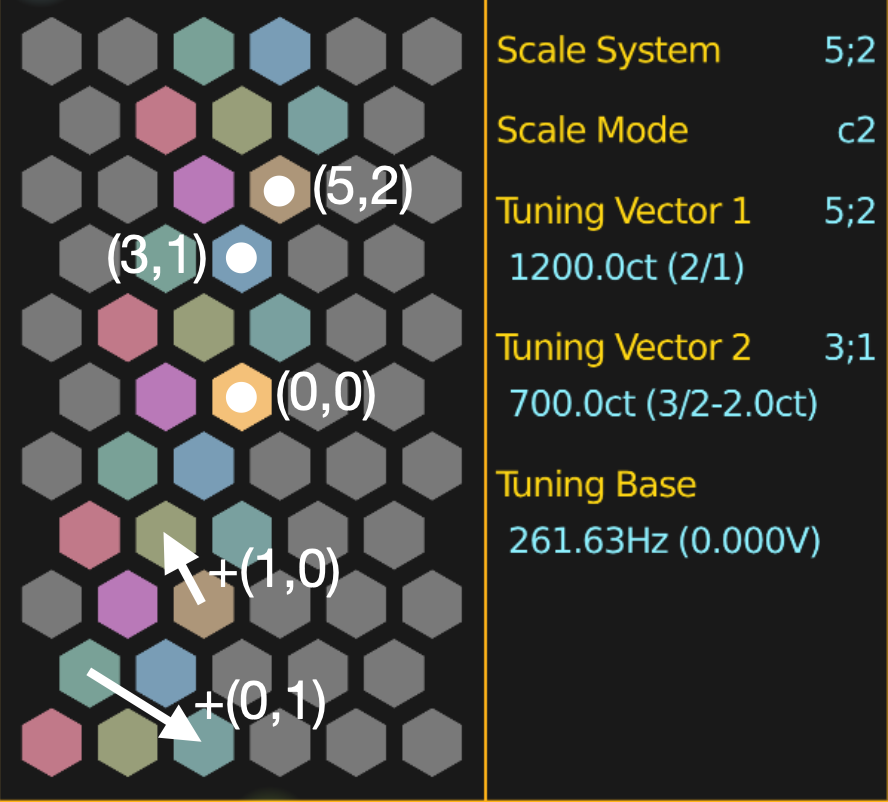

Each key has a scale coordinate on the hexagonal lattice. The Western scale has 5 steps of one size and 2 steps of another, thus it has scale system $(5,2)$, as shown in the 1st row of the info display. The C one octave above the base, which is at the scale coordinate $(5,2)$, is tuned to $1200ct$ (corresponding to a frequency ratio $2/1$). This is the first tuning vector. The G, at $(3,1)$, is used as the second tuning vector and is tuned to $700ct$ (or $2ct$ below the just $3/2$ ratio). The base note is tuned to the standard C of $261.63Hz$, which corresponds to a 0V signal at the microtonally adjusted V/OCT output. The two intervals together with the base note frequency define the tuning of the complete keyboard. The selected tuning corresponds to the standard 12-TET in C Major.

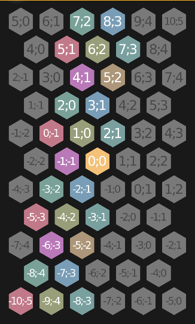

You can always change the labels to show the scale coordinates of each key.

### Changing Modes
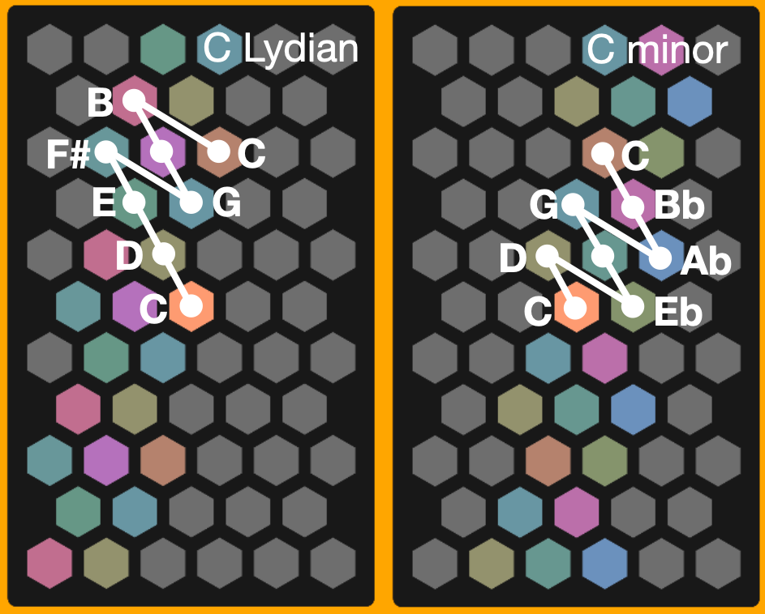

Rotate the rightmost controller to change the mode. All 7 church modes associated with the base note are available. They are numbered in sequential order (as accidentals are added). C Lydian is mode c1 (the c stands for "church". Future versions of the module might introduce other scales, like double-harmonic.)

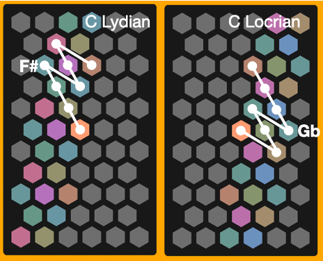

F# and Gb are different notes. You will find them on different keys on the keyboard. In tunings other than 12-TET they have different pitches.

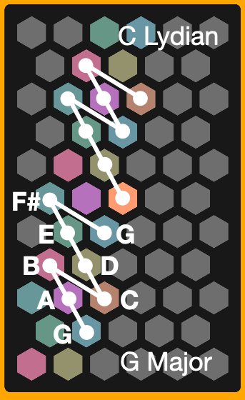

Mode changes correspond to key changes.

### Tuning
Press and hold the second key on the bottom row of the Exquis. In MicroExquis, this is the tuning selection button. 

You are now in the tuning selection view. Only the first octave above the base note is displayed. You can now select which interval you want to tune.

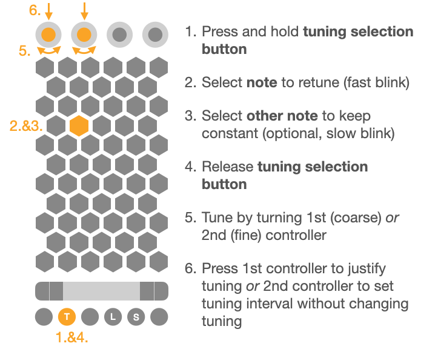

With the tuning selection button being pressed, select the interval you want to tune. The selected key start pulsating. Now you can release the tuning selection button. You are in tuning mode. In tuning mode you can rotate the first (coarse tuning) or the second (fine tuning) controller at the top of the Exquis. This will  change the tuning in real time. 

- Selecting the base note allows to re-tune the Exquis as a whole.
- Selecting the octave will stretch or squeeze the tuning proportionally. 
- Selecting a scale note will keep another note constant. If you now release the tuning selection button, the octave will be selected to be kept constant. 
- (Optional) Select a second note (other than the base note) to be kept constant. 

The note to be tuned will blink fast, the note to be kept constant will blink slow. Watch the info display for changes in the tuning. Justify the tuning by pressing the first controller (top left).

With this feature, it is very easy to achieve some historically important regular tunings. (See the section _Notable Scales_ below.)

Note that negative scale steps are explicitly allowed. 

Note that you can always use the octave-up and octave-down controls on the Exquis. This will shift the pitch of the Exquis as a whole by the frequency ratio of the 8ve. This feature is available outside tuning mode, as well.
### Layout
The note layout in the MicroExquis always has transpositional _and_ tuning invariance. Anything you do is both geometrically _and_ harmonically isomorphic. This means that any interval or chord has the same geometric shape _and_ the same sound (i.e. same frequency ratios), no matter where they are played. Within these bounds, anything is possible.

Press and hold the fourth key on the bottom row of the Exquis. In MicroExquis, this is the layout button. 

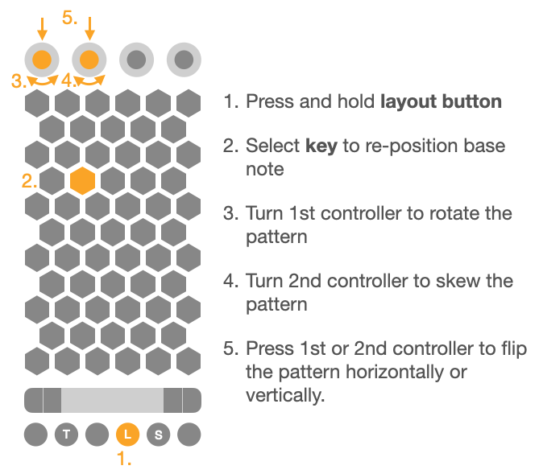

Pressing a key in tuning selection button will re-position the base note's location. Turning the 1st controller will rotate the pattern around the base note. Turning the 2nd controller will skew the pattern horizontally, keeping the row with the base note unchanged. Pressing the 1st controller will flip the pattern horizontally, while pressing the 2nd controller will flip it vertically.

By changing the layout it is possible to arrange the keys to your liking. Some possible arrangements for the Major scale:
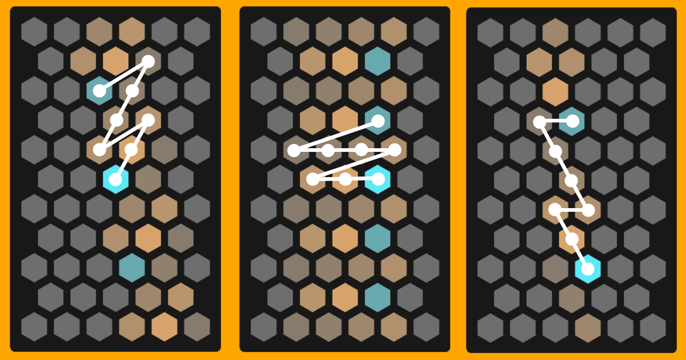

On the MicroExquis display, with the _Labels_ setting set to _notes_, you see the diatonic steps being numbered sequentially.
### Scale System Selection
Press and hold the 5th button in the bottom row of the Exquis. This is the **scale system selection button**. 

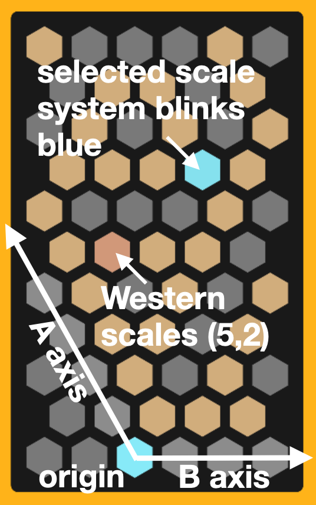

A pattern appears. You can select a different scale system, corresponding to the pair of numbers of steps of each of the two sizes in the scale. Count the number of steps along each axis to determine the number of steps of size $A$ and size $B$ for the scale. Allowed selections are displayed.

Note that selecting another scale system does not retune any of the keys. If a compatible VCO (like the MicroHammond) receives the TDAT signal (for microtonal adjustment of the overtone spectrum), the timbre of the sound may change significantly, though. This is because the TDAT signal carries information on the selected scale, too, and may use the information to adjust overtones accordingly. This adjustment of the overtones is important if you want chords to sound consonant in a chosen tuning.  The MicroHammond module will tune the overtones based on the scale system, as well as the first and the second intervals defining the tuning of the PitchGrid lattice.

Selection of modes works in analogy to the selection of church modes in the Western scale system.

Only scales where the pair of numbers of the two step sizes is coprime are allowed.

Accidentals are selected between flat and sharp according to the relative size of the frequency ratios of $(0,1)$ and $(1,0)$. There are two possible conventions. Either the larger one is neutral and the smaller one is flat, or the smaller one is regular and the larger one is sharp. For the PitchGrid (as implemented in MicroExquis), it depends on the ordering of the scale system. Both $(5,2)$ and $(2,5)$ lead to the same scales, but only $(5,2)$ will have the convention where the Major 2nd is neutral and the minor 2nd is flat.

If the scale system selection view does not display your desired scale class (because it is outside of the range of the display), you can save a preset VCV PitchGrid MicroExquis preset file, open it in a text editor and adjust the scale system to your liking. (Remeber that the numbers must be coprime.) 

## Reverse Tuning
Normally you tune an instrument's pitches to a scale in a way that consonance at certain intervals is achieved. When you start with a harmonic spectrum (most instruments) you will end up in a small subset of all possible tunings. In reverse tuning (also known as dynamical tonality), you start with scale and a tuning, and microtonally adjust the overtones to fit the given set of pitches. This will lead to unusual sounds with timbres that do not normally occur in nature, but these strange sound might sound better with your chosen tuning, because overtones of the intervals you tune to now match. This achieves consonance for arbitrary scales. 

Mainstream music production technology, however, separates tuning from timbre, and thereby makes it difficult to synchronize tuning and timbre (which  in reality are intimately connected). Virtually all VST instruments, if microtonally enabled, will have fixed timbres. If they offer tweaking with the timbre, the process of synchronizing timbre to a tuning is cumbersome, or they are badly integrated into the DAWs. 

MicroExquis was built with this in mind. You now can easily experience the effects of reverse tuning on timbre and on harmonies, and compare the results with sounds having the usual harmonic spectrum. 

MicroHammond is a sound module that allows you to do just that. It is also part of the PitchGrid VCV Rack plugin. It is the first in a series of planned instruments that allow for reverse tuning. 

### MicroExquis & MicroHammond
You can use the MicroExquis module to reverse tune the MicroHammond. When the TDAT (Tuning DATa) signal is connected between the two modules, the MicroExquis transmits information about the tuning and the scale to the MicroHammond module. 

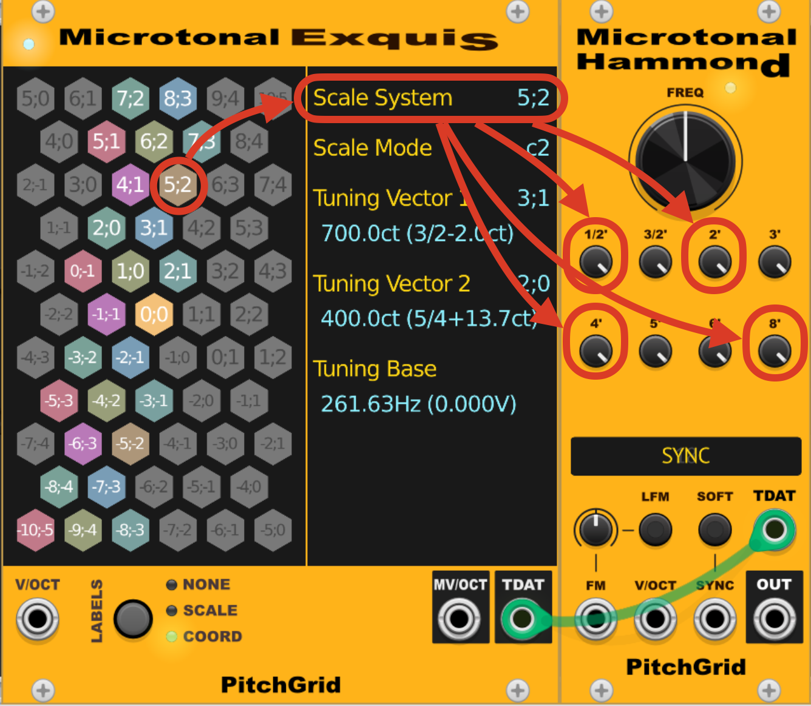

The MicroHammond's oscillators associated with the octave, (sub-harmonic at half the frequency 1/2', second harmonic 2', fourth harmonic 4' and eight harmonic 8') are tuned according to the frequency ratio of the scale system. This corresponds to the frequency ratio between the (generalized) octave ( which always has the coordinates of the scale system) and the base note.

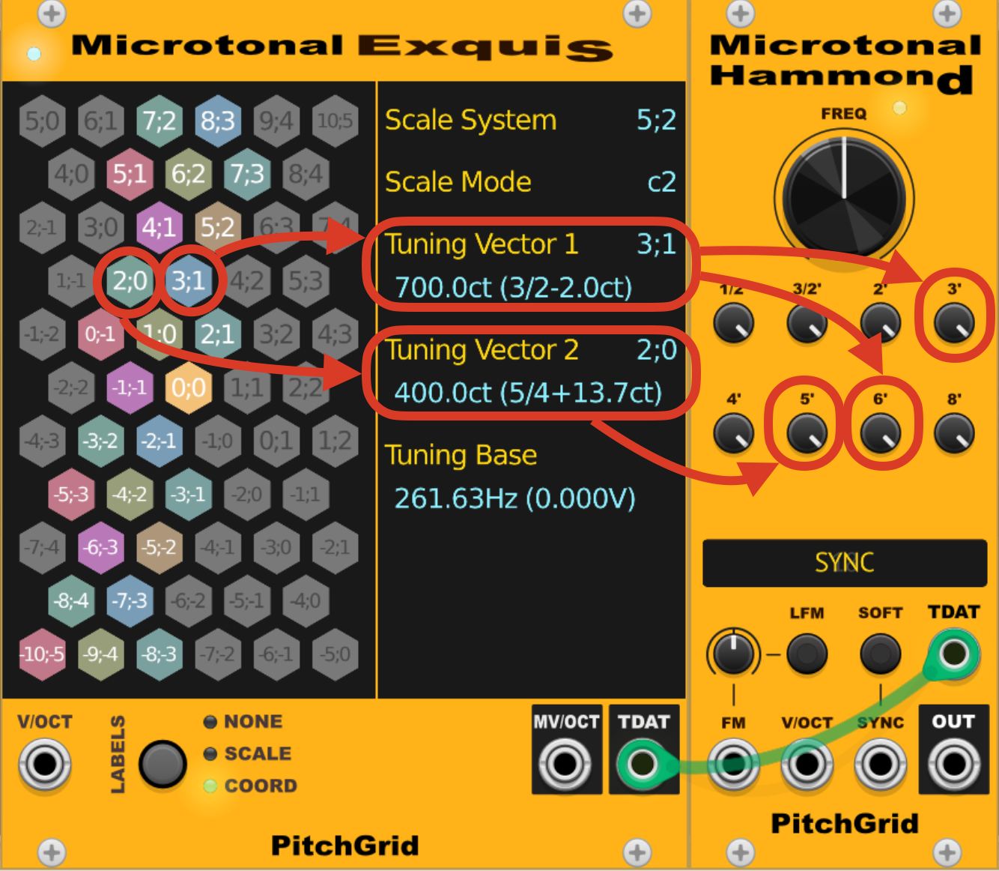

The MicroHammond's oscillators associated with the perfect 5th (third harmonic 3' and sixth harmonic 6') are tuned based on the first tuning vector. In the shown configuration, the first tuning vector is set to have a frequency ratio $700ct$ above the base note. The oscillators associated with the major 3rd (fifth harmonic 5') is tuned based on the second tuning vector. In the shown configuration, the first tuning vector is set to have a frequency ratio $400ct$ above the base note. In this configuration the tuning of the MicroHammond corresponds to the original Hammond organ's tuning.

To set the two tuning vectors, go into tuning mode, select the keys with the coordinates you want as first and second tuning vectors, and engage the *set tuning* selector (i.e. press the second controller at the top of the Exquis). The pitches of the PitchGrid will stay unaltered, but the MicroHammond's timbre will change.
### How it Works
When the MicroExquis module is in an active VCV Rack patch and the Exquis is connected to the host via USB, the module takes over the control over the Exquis. The Exquis Desktop app or any other processes that also would try to control the Exquis, should not run at the same time.

To use all features, the module requires an Exquis to be connected. The parameters of the module are controllable from the Exquis only. One can, however, use the module without an Exquis being connected, by loading presets. This is useful if a MIDI stream from the Exquis (with the module active) has previously been recorded into a DAW and is now played back from the DAW and routed into the patch.

The connection LED at the top left indicates whether the Microtonal Exquis module has a connection to the Exquis. When the Exquis is connected, the LED lights bright blue, otherwise red.

When the Exquis is connected, the module assigns MIDI note numbers to the 61 keys of the Exquis, starting with MIDI note number 36 at the bottom left key and ending with MIDI note number 96 at the top right key. This assignment is fixed.

Connect the V/OCT output of the default MIDI->CV VCV Rack module directly to the V/OCT input of the MicroExquis module. MicroExquis does not itself process the note_on events, and expects the V/OCT signal to correspond to the key mapping as per the standard V/OCT convention. This way a DAW can be used to route the MIDI signal into the MicroExquis. The MIDI->CV module should be configured to have Pitch bend range _off_, Polyphony channels _16_ and Polyphony mode _MPE_. MicroExquis cannot deal with pitch bend applied to the V/OCT signal, and the behavior is undefined.

From this input signal, MicroExquis calculates a microtonally adjusted V/OCT signal that can be consumed via its MV/OCT output. The output depends on the tuning and the layout, configured via the Exquis. Pitch bend can be applied to the MV/OCT signal, as in the example patch.

The MicroExquis also outputs information on the tuning and the scale used to via the TDAT output. This signal may be consumed by a VCO that supports microtonally adjusted overtone spectra (aka dynamic tonality), like the PitchGrid Microtonal Hammond (MicroHammond) module. This way, the timbre of a sound can be made to match a chosen scale and tuning. 

The info display shows information on the chosen scale (1st row), the tuning of the PitchGrid (2nd and 3rd rows) and the base frequency (4th row).

In the following we assume that the Exquis and the MicroExquis module are connected, i.e. when we refer to properties of the Exquis, we imply the features available via MicroExquis.

### Theory
The theory behind the MicroExquis is not common knowledge. None of the concepts is really new, and I could point the reader to resources on MOS-Scales, rank-2 temperaments and dynamic tonality. I find, however, the terminology in the literature unnecessarily complicated, and often obfuscated by hidden assumptions. In an attempt to rectify this issue, I thus shall describe what lies behind the PitchGrid idea in terms that hopefully make the relationships easier to grasp for the reader. I shall start from physics and arrive at a motivation for the PitchGrid concept. (The versed reader shall forgive me when I oversimplify matters, which is true. I do it with the intention to accentuate the factors I think are important, and leave out the details that I think are not.)

### Physics
Any physical body, when excited, will radiate its energy at discrete frequencies called partials. The set of partials at which the body radiates is called its spectrum. The deepest of the bodies frequencies is the fundamental, or the first partial. The timbre of a sound is strongly influenced by the frequency ratios between a partial and the fundamental. The timbre is what gives a sound an identity. The frequency of the fundamental is the pitch of a sound. An instrument is a physical body that can radiate at different pitches while maintaining timbre, and with it the frequency ratios between its partials.

When making music, as a social activity in which multiple sounds are created simultaneously, our brains feel a desire to achieve sensory consonance. Sensory consonance is achieved when the partials of different sounds have the same frequency. It is this desire that is the foundation of building scales, i.e. sets of pitches that go together well. 

It is a common misconception to think that it is just frequency ratios between pitches that in and out of themselves achieve consonance. This is not so, as has been demonstrated repeatedly. I refer the interested reader to the work of William A. Sethares. A related misconception is that the spectrum of a sound is always harmonic, i.e. that the frequencies of the partials are always multiples of the fundamental's frequency. What is true is that the instruments we prefer to use in Western music mostly have a harmonic or an almost harmonic spectrum. But the sound generated by a random physical body in general does not have a harmonic spectrum. In fact, even a piano string's first overtone will ever so slightly deviate from a just 2:1 ratio. This knowledge, together with the possibility to create sounds with arbitrary spectra using digital technology, vastly increases the space of scales that might be interesting to look at.

Another desire when making music is to play melodies. Melodies are temporal sequences of sounds, and we perceive satisfaction when we recognize fragments of melodies, motifs or phrases. Regular scales exhibit a small number of different step sizes, and give the musician rich transpositional possibilities concerning motifs and phrases. 

Good scales then are regular scales that have consonant intervals.

### Structure from Tuning
Tuning is the process of adjusting the pitches of an instrument with a given timbre such that they give rise to a good scale for music making. Reverse tuning is the process of adjusting the timbre of an instrument to a given regular scale such that consonance is achieved.

It is not a coincidence that cultures that use scales with little relationship to Western tonality prefer instruments with non-harmonic spectra. Gamelan music of Indonesia has a long tradition of reverse tuning, in which the bells are shaped to have their spectra fit a scale. It is thus natural to use an arbitrary regular scale with sounds of a (in general non-harmonic) spectrum that fits the scale's tuning, as this automatically ensures consonance for certain intervals. 

The Pythagorean tuning procedure entails defining an identity with the 2nd partial (which we call octave) and then recursive tuning pitches in between by adjusting pitches to match 3rd and 2nd or 4th partials. This procedure naturally yields the Western diatonic scale (a regular scale) for any almost harmonic spectrum after 6 iterations. It comprises the cyclic pattern $AAABAAB$ of two different tone sizes $A$ and $B$, repeating above and below the octave indefinitely. We arbitrarily label the base note we started with and the octave with the symbol F, and the six notes in between obtain the labels G,A,B,C,D and E. The pattern can be shifted by flipping the order of the third and fourth tone in this pattern, yielding the pattern $AABAAAB$. Such a shift in the pattern is tantamount to changing mode (when the base note stays the same) and changing key (when the base note is shifted with the pattern). The particular pattern shift we look at corresponds to lowering the 4th note's pitch by the amount $A-B$. The note with the label B becomes Bb. Lowering and raising notes is what we refer to as adding accidentals to notes. They retain the association with a given diatonic note because of the context of the whole scale. 

The resulting structure, a cyclic pattern of two different tone sizes, 5 $A$s and 2$B$s, along with the ability to change keys or modes by raising or lowering exactly one note, are the defining properties of most of Western music theory, including its modulation richness. We can change modes 7 times while maintaining the base note. This yields the 7 church modes in Western music. 

We seek to generalize the structure of Western music theory to arbitrary scales. If we want the cyclic pattern to shift (but otherwise stay intact) upon lowering or raising exactly one note, two conditions must be met:
1. The number of $A$s ($a$) and the number of $B$s ($b$) must be coprime, i.e. $a$ and $b$  must not share prime factors, and
2. the tones As and Bs must be distributed as evenly as possible. 
We thus define the term (generalized) diatonic scale as being a scale that obeys these two properties. The smallest such scale consists of two notes and has the cyclic pattern $AB$, and changing mode / adding an accidental to the only note between base note and octave yields the pattern $BA$. Any pair of coprime numbers $(a,b)$ constitutes a scale system, which has exactly $a+b$ (generalized) church modes (i.e. cyclic patterns that can be shifted by raising or lowering exactly one note) associated with it. 

### The PitchGrid
Diatonic scales are conveniently visualized on a two dimensional lattice of pitches, where the frequency ratio between adjacent nodes along one axis are equal to the tone size $A$, and are equal to the tone size $B$ along the other axis. A diatonic scale is a path on this lattice, connecting a base note node with a (generalized) octave node, following edges according to the scale's $A$-$B$-pattern. If the node associated with the base note has coordinate $(0,0)$, the octave is associated with the node at $(a,b)$. Scales are paths connecting $(0,0)$ with $(a,b)$. 

Adding accidentals is moving diagonally from the upper left to the lower right. Every node on such a diagonal is associated with the same diatonic note. A diatonic scale visits each diatonic diagonal exactly once. 

Let us draw a straight line between $(0,0)$ and $(a,b)$. There is exactly one church mode whose notes are all above the line. We call this the first church mode, or mode $c1$. We obtain all other church modes by repeatedly lowering exactly one note while maintaining the cyclic structure, and number them in sequential order. (After $a+b-1$ lowerings, we arrive at a church mode whose notes are all below the line between $(0,0)$ and $(a,b)$. ) Following the convention from Western music, where Major is the most important mode, we pick labels for the nodes such that the labels of the mode $c2$ is free of accidentals. To avoid confusion, instead of using latin letters as symbols, we use numbers, starting with $1$ for the base note, $2$ for the second, etc.. 

Note that arbitrary re-tuning of the lattice retains all the structural properties discussed above. We can allow for negative tones, and the building of scale systems and their church modes stays unaltered. Furthermore, a tuning assigns frequencies to every node on the lattice, whether the node is part of a scale or not. We thus can say that scales live on a tuned lattice. The tuning of the lattice is uniquely determined by the frequency ratios of two (linearly independent) intervals.

For tunings without negative tones, the mode $c1$ of any scale system can be recovered by generalizing the Pythagorean tuning procedure to arbitrary spectra, where the 2nd and 3rd partials have arbitrary deviations from their harmonic (just) ratios of 2:1 and 3:1. They exactly correspond to the MOS scales uncovered by Erv Wilson. 

### Isomorphic Keyboards
The regularly tuned lattice is a straightforward generalization of equal temperaments to two dimensions. In the way that one dimensional keyboards (like the piano keyboard) suit 1d equal temperaments, 2d isomorphic keyboards fit 2d regular temperaments. 2d keyboards make the Pythagorean idea of closing of the circle of fifths after 12 steps obsolete. We should hence talk about the spiral of fifths.

For any chosen scale and any chosen layout, the tuning of the hexagonal keyboard of the MicroExquis is regular. This means that all frequencies are determined by the base frequency and the choice of two frequency ratios, one for each of the two dimensions of the keyboard. This is analogous to equal temperaments (ETs), which provide regular tunings to one-dimensional keyboards. This makes the Exquis a harmonically isomorphic keyboard, which means that the frequency ratios for an interval or a chord are uniquely determined by its geometric shape. The two defining frequency ratios are displayed on the info area. Each one is defined by specifying a coordinate on the lattice relative to the base $(0,0)$ and a frequency ratio. Any two coordinates can be chosen as long as they do not lie on one line with the base. 

Different layouts on the MicroExquis correspond to affine transforms of the PitchGrid lattice onto itself. It is straightforward to map 

Head over to [the PitchGrid Web App](https://pitchgrid.io/) or the [the PitchGrid Scale Mapper Web App](https://pitchgrid.io/scalemapper) to learn more.

### Elaborating on the Relationship to MOS
As outlined above, all scales from Erv Wilson's Moments of Symmetry (MOS-scales) can be discovered in the PitchGrid. In large parts, the two frameworks are equivalent. There are, however, some good reasons why the MOS terminology is not being adopted here. I feel that there is value in building a bridge between Western music theory and a generalization thereof. Erv Wilson's terminology introduces new concepts that lie outside the realm of common music theory education, and if it is possible to lay out a generalization without new terminology, one should do so. It should be understood that I have deep admiration for Erv Wilson, who has revealed so many structures in music for the first time. My goal, however, is to make the MOS universe accessible to a wide audience, and allow people to navigate it with ease. The need to understand Erv Wilson's terminology might come with a mental overhead hindering adoption, and the PitchGrid concept works under the assumption that this burden can be removed. 

Scales in the MOS logic are constructed by choosing two continuous parameters, an interval of equivalence (which is a generalization of the octave concept from Western music, relaxing the requirement of justness) and a generator. Each pair of these parameters then will generate a series of scales, of two different tones (diatonic scales) with particular frequency ratios for each of them. The structure of the series of scales (i.e. how many intervals of each size, and in which order) is determined by the particular choice for interval of equivalence and generator. MOS scales come with a tuning. The relationship between tuning and structure is thus built in. 

In contrast, the PitchGrid separates structure from tuning. We require two tone sizes and a cyclic structure which allows for mode changes by raising or lowering single notes. We lay out this structure on a two dimensional quadratic lattice, with a clear interpretation of what raising and lowering notes means. We can readily derive a canonical naming convention for the notes which carries over from Western music theory conventions. All without talking about tuning at all. And tuning is as simple as specifying frequency ratios for two intervals.  Arguably, this perspective is easier to conceptualize for someone familiar with Western music theory, and therefore more approachable.

What is common to both frameworks is that they work on a direct generalization of one dimensional equal temperament scales to two dimensions. The PitchGrid lattice may be thought of as a two-dimensionally equal temperament (or 2d regular temperament), on which all MOS scales live. While the 1d equal temperaments are well suited for one dimensional keyboards like the piano keyboard, two dimensional isomorphic keyboards like the Exquis are a perfect fit for 2d regular temperaments.

## Notable Scales
Here are listed some common regular scales, some of them available as presets in the MicroExquis. They also are well suited to be taken as exercises to familiarize yourself with the tuning feature of the MicroExquis.
### Western Scales
These scales are all within the Western scale system of $(a,b)=(5,2)$ where both $A$ and $B$ are positive and $A$ is wider than $B$. 
#### 12-TET (12-EDO)
This is the temperament most commonly used in Western music today. It is the temperament in which the circle of fifths closes. An $(a,b)=(5,2)$ scale system within an equal division of the octave, i.e. hardness is $A:B=2$. ($5\cdot2+2\cdot 1=12$) Justify the octave to $1200ct = 2/1$ and tune the perfect 5th to $700.0ct$. 
#### Pythagorean
A $(5,2)$ scale with just 5ths. Justify the Octave to $2/1=1200.0ct$ and the perfect 5th to $3/2=702.0ct$. The most important interval is also the most stable one. This tuning is indistinguishable from Garibaldi.
#### 1/4-comma Meantone
The octave (2/1) and the Major 3rd ($5/4=386.3ct$) are just. This tuning gained importance in medeival times (first mention in 1496). For instruments with nearly harmonic spectra it makes the Major 3rd to be at rest.
#### 1/3-comma Meantone
The octave (2/1) and the minor 3rd ($6/5=315.6ct$) are just. Suitable for pieces in minor. 
#### 19-TET
Same scale system as 12-TET, different tuning, with hardness $A:B=3:2=1.5$ ($5\cdot 3+2\cdot 2=19$) Justify the octave to $1200ct=2/1$ and tune the perfect 5th to $1200ct\cdot\frac{3\cdot 3+1\cdot 2}{19}=694.7ct$. (The perfect 5th has three As and one B. Hence we take three times the size of the A in 19-TET, which is 3 units, and once the size of the B, which is 2 units, totaling $3\cdot 3+1\cdot 2=11$ steps out of $19$.
####  31-TET
$(5,2)$ within 31 equal divisions of the octave, with hardness $A:B=5:3=1.67$ Tune this temperament is very close to 
#### 1/2-comma Cleantone
The perfect 5th ($3/2$) and the Major 3rd ($5/4$) are just. The octave is $11ct$ wider than just. This temperament makes all stacks of 3rds just (as the minor 3rd becomes ($6/5$).) In the [Musical Tonailty paper](https://papers.ssrn.com/sol3/papers.cfm?abstract_id=4452394) by Hans-Peter Deutsch it is mathematically proven that this is the best sounding temperament for Western music (according to some measures).

### Common Microtonal Scales
Here you are entering new territory. Music theory works differently. Chords that sound good are different, which has implications on chord progressions and well suiting rhythmic structure, too. A wide universe waiting to be explored by you. You can find more information on these scales on the Xenharmonic forum, but best to just try out.
#### Mavila
A $(5,2)$ scale where the $A$ is narrower than the $B$. The Pelog scale used in Indonesian Gamelan music is well approximated by a Mavila scale in 9-EDO (i.e. $A=1$, $B=2$). Justify the octave to $1/2=1200ct$ and tune the perfect 5th to $1200ct\cdot\frac{3\cdot 1+1\cdot 2}{9}=666.7ct$.
#### Bohlen-Pierce
This scale is well suited for instruments that have strong odd harmonics and weak even harmonics. The scale system is $(5,4)$. The (generalized) octave is tuned to $3/1$ instead of $2/1$ and the Major 4th (coordinate $(2,1)$) is tuned to a just $7/5$ ratio. 
#### Magic (3,4)
Magic temperaments are born out of the idea that $(5/4)^5\approx 3/1$. In a $(3,4)$ scale system you can tune the octave to $2/1$ and $(1,0)$ to $6/5$, resulting in 3 large and 4 small steps.
### Magic (3,7)
Another variant of the magic temperament is to have a $(3,7)$ system and tune the large interval to $7/6$.
### Fun with the MicroExquis
1. Compare harmonies played in reverse-tuned (i.e. microtonally adjusted) timbres with conventional timbres by disconnecting the TDAT cable and configuring other timbre tunings from the preset. Feel the difference.
2. Record a chord sequence or a melody from Exquis to the DAW and play it back into the patch in a loop. Now change the tuning and the note layout while the loop is playing.
3. Pick a scale and a tuning. Choose a direction at will, and improvise by playing notes from even lanes along the chosen direction in even bars and odd lanes in odd bars, or apply similar patterns in your improvisations.
4. Share your experiences. We are explorers of a new world of harmony.

## FAQ

Q: Can I use MicroExquis to play any possible scale in any possible tuning?
A: No. MicroExquis only supports two dimensional regular tunings. Irregular tunings, like Werckmeister III, were born out of the necessity to hide undesirable commas for instruments with one-dimensional keyboards. Having two-dimensional, fully isomorphic keyboards together with reverse tuning, makes this kind of historical tuning systems obsolete. 

Q: Why did you choose the Exquis? 
A: The Equis is expressive, affordable and externally controllable. I saw the possibility to build a tool that opens the door to the universe of MOS scales in an approachable way. 

Q: Why don't you support any other controllers?
A: I'm a solo developer. Nobody pays me. My time is limited. The source code is open and you can either join me in my efforts and help build some or fork the repo and build on top of it.

Q: Why did you choose VCV Rack?
A: VCV Rack is very flexible and free. It allows to realize my ideas about reverse tuning.

Q: Why did you not implement a VST plugin directly?
A: I consider reverse tuning to offer great potential. Scales and tuning are intimately related. The thinking of most tool builders separates tuning from timbre, which leads to technology (DAWs and VST plugins) that do not account for that relationship and thus are limiting.

Q: Why don't you use Scala tuning files?
A: Scala tuning files are one dimensional. They silently assume that you are playing a one-dimensional keyboard, like a piano keyboard, with a sequential set of pitches. When the objective is to harness the power of the two dimensions of the structure of musical tonality, Scala files are limiting.

Q: Isn't MIDI also one dimensional and limiting?
A: Yes. It is like it is. What I built is a compromise. 

Q: What you call reverse tuning already has a name: dynamical tonality. Why don't you call it that? Do you want to re-write history?
A: Yes, to the best of my knowledge I use the terms synonymously. So why do I introduce a new term for something that already has been named? It's because I think the term _reverse tuning_ better captures what the concept of dynamical tonality is all about. There is nothing dynamical about microtonally adjusting overtones, after all. It only becomes dynamical when the timbre changes in the course of a composition, which the technology certainly enables when employed digitally, but it's not the gist of the idea. Besides, the term reverse tuning accounts for the fact that different cultures used to adjust their instrument's timbre to fit a scale in the past and at present, like the Gamelan bells or xylophones used in Central Africa. This way, the term _reverse tuning_ is true to  history in a way that _dynamical tonality_ is not.

