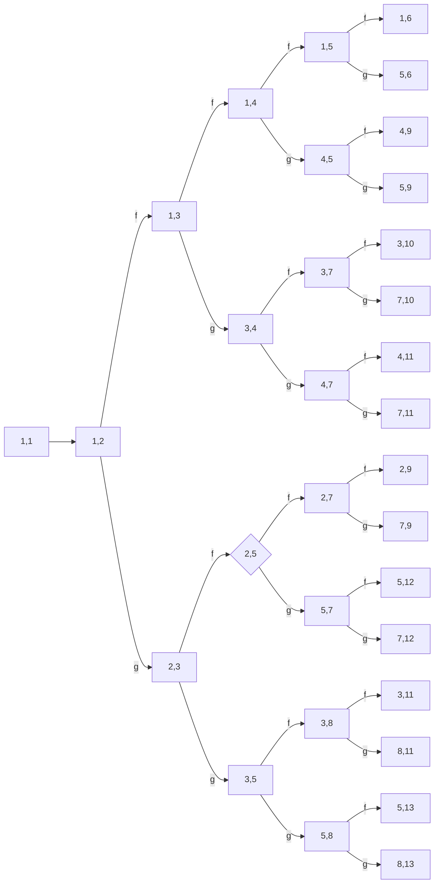
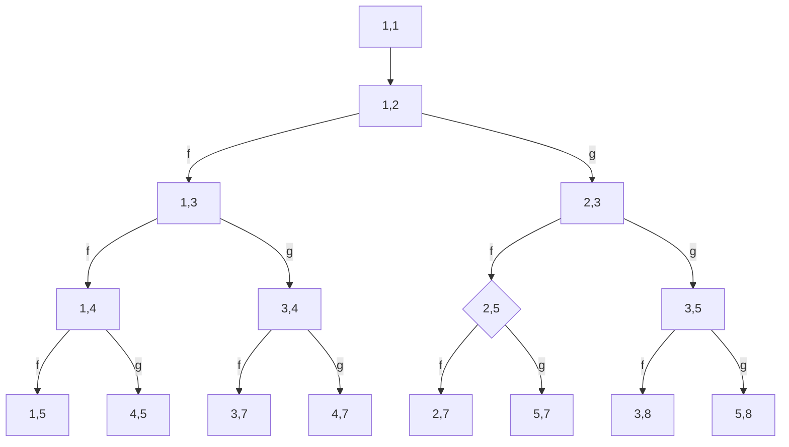

_Peter Jung_
_2024-08-15_

What is the essence of the tonal structure of Western music? How does it relate to scales used all over the world and why? And what tonal possibilities are hidden in plain sight?

This note is about a discovery I have made in my attempt to gain a better understanding of the above questions. I am not particularly proficient in music theory or its mathematics. But the beauty of what I have discovered is astounding, its power in answering the questions posed above if baffling, and I am puzzled by the fact that a simple and elegant construction that I came up with, which I have materialized as the [PitchGrid](https://pitchgrid.io/) web app, is not a standard way of understanding and teaching musical scales. For me, the PitchGrid concept cleared up a lot of confusion, and I hope that this is the case for the readers of this note, as well. Possibly someone else did come up with a similar construct in the past. But all I could find were traces of it, nuclei, undeveloped kernels. The few discoveries I have made suggest that Bach might have been aware, consciously or not, of the structures that appear from the PitchGrid construction. This discovery and many others the PitchGrid evoke a feeling of urge in me to share this knowledge with the world.

Using the PitchGrid concept, we will uncover some basic principles governing not only Western music, but a universe of alternate tonal systems with similar structural, yet audibly distinct characteristics. In other words, we will formulate a general theory that not only accommodates all of Western musical structure but the structure of a host of other tonal systems. For instance, we will bridge the gap between the tonal system of Western music and Wilson's moments-of-symmetry (MOS), and uncover a generalization of the familiar structure of the former that fully accommodates the latter. 

This resource is created with composers and builders of digital musical instruments in mind, who are already familiar with the basics of Western music theory. Young composers willing to explore what lies beyond the 12-tone equal temperament are intimidated by the intellectual and practical complexities that quickly arise. The hope is that the new understanding presented here removes a great deal of that burden. While this work can tackle the intellectual complexities, it is up to the instrument builders of today to remove the practical ones. Digital technology opens up new possibilities in instrument creation. All too often the 12 tone equal temperament is assumed as an unalterable given, unnecessarily restricting their instrument's possibilities. For one, isomorphic keyboard layouts (like that of the [Lumatone](https://lumatone.io) will serve as a more than useful model for implementing a wide variety of tunings that are structurally similar to the Western tonal system, but the software implementations often are limiting. Besides, the presented theory has implications on the relationship between the tonal system and the timbre of an instrument. In fact our theory hints at the desirability of micro-tuning the overtone spectrum to fit the chosen tuning, and digital technology enables us to do so. 

The formulation of our principles will lead to an astonishingly simple and elegant, yet powerful explanations. Furthermore they will enable us to take a systematic, constructive approach toward creating new music theories. The price we will need to pay is to abandon certain assumptions implicit in our shared wisdom. In other words, the reader should be open minded. Creating new music is an adventure, and we present a rough map that shows the way to  what lies beyond what has been heard before. Shall the reader endeavor to see the rich reality of what our rough map is able to outline.


## Myths of Music Theory

### Pythagorean Tuning

Two and a half millennia ago, Pythagoras observed the spectrum of a resonating string and outlined a tuning scheme to generate a seven tone scale based off it.

1. Take the first two overtones in the harmonic spectrum of the string. These resonate at frequency ratios 2:1 and 3:1 as compared to the base frequency.
2. Define the first of these ratios (2:1) as an interval of equivalence, let's call it octave. 
3. Find the tone that has the second overtone (3:1) as an octave. This gives us 3:2. 
4. Stack that 3:2 interval six times and reduce the octave for each of the six instances.

If we now arbitrarily name the seven frequencies thus obtained in the order of increasing pitch F,G,A,B,C,D,E, we are pretty close to what we today call the Lydian mode in Western music. By giving the octave the same name as the base note, F, we now have a cyclically repeating sequence of notes. Picking one of them as a base note and walking upward is what defines a diatonic scale of Western music, and the notes are called diatonic notes. We thus retrieve seven possible diatonic scales, corresponding to the seven modes of Western music.

```music-abc
L:1
FGA(Bc)d(ef)
w: F G A B C D E F
w: _ +204ct +204ct +204ct +90ct +204ct +204ct +90ct
W: Fig 1. Sequence of notes resulting from the Pythagorean tuning sequence, 
W: also referred to as Pythagorean temperament.
```
When looking at the intervals between neighboring notes, we can make the observation that we have five large and two small intervals. The small intervals here are connected by a slur, to highlight them. Below the note names, we show the number of cents that that interval is apart from the one below it. Remarkably, all large intervals have exactly the same size (+204ct), as have the two small intervals (+90ct). This in fact is a consequence of our construction procedure and must be so, as can be mathematically proven (see the 3-Gap Theorem, aka Steinhaus conjecture). For the sake of clarity we refrain from diving into technicalities. But we will re-discover this fact by utilizing our own construction procedure later on. 

This cyclic sequence of intervals that we obtained already defines the basic structure underlying classical Western music, and we will have a lot more to say as to what this structure entails. What the structure does not tell us, however, is the perceived qualities of notes heard together or in direct succession. Let us thus ask the question: What makes a harmony sound well? 

### Harmony and Resonance

The explanation for when notes sound well together is universally given in the same manner and is at the same time universally wrong. It is one part of popular wisdom that needs to be revised. The common explanation (a modified version of what Helmholtz outlined in his seminal work "On the Sensation of Tone") goes like this. 

Our instruments have a harmonic spectrum, and the relative amplitudes of the partials (base frequency and overtones) determine their timbre, with higher harmonics typically decreasing in amplitude (and decaying faster). When two notes are played together, their spectra mix. Two notes sound well together if they share partials. Partials that are close, but do not exactly meet, generate beatings that are not pleasant and should be avoided. That is why the octave (2:1) is the most important interval. All partials of the octave are also overtones of the base note. This strong association between a note and its octave is what leads to the fact that the octave gets the same name (F and F') and that the octave defines the period of the cycle of the repeating sequence of the notes of a scale. The perfect fifth (3:2) (which is called such because it appears as the fifth note in the scale resulting from the Pythagorean construction outlined above) is the second most important interval. Its first overtone is the second overtone of the base note (3:1), and every other overtone is shared with the base note, as well.

These two intervals, 2:1 and 3:2, the defining characteristics of the Pythagorean tuning, are not only by construction the most important, but also theoretically the best sounding intervals in this tuning: No other interval will have so many common partials.

In passing we remark that there is a rich history of science that deals with finding tunings (or temperaments) for the Western tonal system that "sound well" i.e. that use intervals that are maximally just (i.e. are defined by frequency ratios that are fractions of small integers, which is tantamount to saying that they share many overtones). As recently as 2023 there is a 500 pages mathematical proof that a certain temperament (that the author named Cleantone) is the best sounding for Western music, according to some measures.

However, the matter is not settled. So what's wrong with all this? Well, it is quite simple and can be summarized in two observations.

1. The sources of music (i.e. resonating physical bodies) do not in general have harmonic spectra (i.e. overtone frequencies are not in general integer multiples of the base frequency).
2. The physics of the human ear is not equipped with hearing just intervals between individual frequencies (when they lack overtones, i.e. are plain sinusoidal waves).

Every physical body has a resonance spectrum, consisting of discrete frequencies called partials. The lowest of the partials, the base frequency, is called the natural frequency of the body. This spectrum is not harmonic in general. This fact is pretty hard to appreciate by someone who learned about just intonations in music, which is due to the ubiquity of the harmonic spectrum argument. Let us thus present some examples as illustration.

Here is the spectrum of a hydrogen atom in visible light.


In contrast to acoustics, we do not see the resonances of the atom (a very basic physical body) directly, but only by observing photons emitted when transitions occur. As Johann Ballmer observed in in 1885, the frequencies of the photons can be described by the following formula:
$$\nu=constant\left(\frac{1}{2^2}-\frac{1}{n^2}\right)$$
The implied energy levels (and thus, per quantum mechanics, frequencies, $E=h\nu$) are not harmonic, i.e. they are not multiples of a base frequency.

This carries over to macroscopic physical bodies. A membrane stretched over a circular ring does not have a harmonic spectrum. Here is a table from Helmholtz's "On the Sensations of Tone" from 1895, listing some of the partials of the circular membrane.


Bells, the Xylophone, or more generally any extended two or three dimensional bodies have spectra that strongly deviate from the harmonic.

The spectrum of an idealized string is harmonic. But a physical string has a thickness to it, and the shear forces in the vibrating string make its first harmonic deviate from the perfect 2:1 ratio ever so slightly (typically upward). The amount of the deviation depends on the thickness of the string, on the physical properties of the mounting material, the shape and material of the resonance body and several other parameters. The harmonic spectrum of an idealized string is thus merely an approximation to the partials of a physical string. The spectrum of an idealized pipe is harmonic as well, but a physical pipe's partials can never be exactly harmonic for similar reasons. The human voice's spectrum is close to harmonic, because the physical process generating the voice forces the vibrations to repeat exactly with the cycle of the base frequency. (However, the vocal tract acts as a filter, referred to as formant, that can lead to a resonant enhancement far above the base frequency where the partials are very tight. These can be perceived as distinct pitches, such as in overtone singing. These overtone pitches have non-harmonic spectra determined by the shape of the vocal tract.)

In sound synthesis, a conventional oscillator generates a perfectly harmonic spectrum. This is because, similar to the human voice, the generated wave shape exactly repeats after one period of the base frequency. In fact, the spectrum of a tone being harmonic is equivalent with a perfectly periodic wave shape, the former implies the latter and vice versa.

In general, since physical bodies do not have harmonic spectra, their wave shape does not repeat after one period of the base frequency. Their wave's shape develops over time. This is not something the human ear necessarily detects. The human cochlea approximately acts as a Fourier transformer, physically restricted to recognizing individual pitches of the overtones with a resolution of at most a couple of cents. There is no physical mechanism in the human ear that would automatically associate a heard frequency $f$ with a simultaneously heard frequency $2f$. If there is an association, it is purely learned by experience and a lifetime of exposure to approximately harmonic spectra. (And what can be learned, can also be un-learned.)

What this tells us is that intervals might sound better if they are not perfectly just, and that this depends on the timbre of the instruments played. A good piano tuner will know to stretch the octave, i.e. will tune the octave somewhat wider than the just ratio (2:1), because such a tuning will sound better. The non-harmonicity in the spectrum of a physical string is part of the explanation.

The Pélog tuning system of Gamelan music of Indonesia has intervals that strongly deviate from harmonic spectra. This is no coincidence. The sources of Gamelan music are hanging gongs (the gamelans) that have distinctly non-harmonic spectra.


The gamelans have particular shapes and sizes that are tuned such that partials sound well together. These gongs would not sound well together if their fundamentals would be tuned to the Western 12-TET, say.

### Scales for Non-Harmonic Spectra

For the sake of argument, let us now suppose that we would like to modify Pythagoras' tuning procedure by adjusting it to the actual physical partials of some hypothetical physical body with a spectrum that deviates from harmonic. For the sake of simplicity let us assume that the first overtone swings at +5ct of 2:1 and the second one at +5ct of 3:1. Now let's carry out the Pythagorean construction procedure from above on these slightly modified partials. We arrive at an instrument-adjusted, altered Pythagorean tuning for the Western scale:

```music-abc
L:1
FGA(Bc)d(ef)
w: F G A B C D E F
w: _ +195ct +195ct +195ct +115ct +195ct +195ct +115ct
W: Fig 2. Sequence of intervals resulting from an altered Pythagorean tuning sequence.
```
Note that (according to Helmholtz' explanation of when an interval sounds good) our hypothetical instrument with its non-harmonic spectrum would sound better in this tuning than the original Pythagorean one, because in this tuning all octaves (an octave now being 2:1+5ct) and all fifths (now 3:2+5ct) would share a maximum number of partials. When played on this instrument, any composition of Western music would sound more pleasant in the altered tuning than in the original Pythagorean one. Conversely, tuning this instrument to the original Pythagorean scale with perfectly just intervals 2:1 and 3:1 would generate unpleasant beatings. 

Musicians exposed to Western music theory of the last centuries will instinctively assume that such a hypothetical instrument would sound worse in and of itself because its first overtones are not just. 

Therefore it is worth pointing out again that the human ear does not have an automatic capability of associating frequency ratios with justness, as Plomp and Levelt have established experimentally in 1965. In these experiments they asked humans to judge dissonance between a pair of sine waves played simultaneously or in short succession, and the following figure illustrates their experimental findings.


As can be seen, the sensory dissonance curve is perfectly smooth. It is only when partials are added to the notes that consonance at particular frequency ratios stands out. The following figure depicts sensory dissonance curve of two notes with a harmonic timbre consisting of six partials.


What we learn from this excursion is that an instrument's timbre and its tuning  are intimately connected and should, in a complete theory of musical harmony, considered jointly. In fact, Willam A. Sethares has worked out how timbre is related to tunings in much detail. 

What we remark in passing is that the Pythagorean tuning procedure should be especially well suited for compositions in which the octave and the major fifth are prominent intervals. If in our composition we would want to focus on other intervals, other tuning procedures might be more suitable for enhancing the harmony. 

Thus there can not be an objectively best sounding temperament. The composition, the tuning and the instrument are intimately interrelated. 

Western music theory is strongly dominated by the consideration of just intervals, which is intimately related to the restriction of focus on harmonic spectra. This connection is so strong that Helmholtz himself deems any non-harmonic timbre as non-musical. In his own words:

> Nearest to musical tones without any upper partials are those with secondary tones which are inharmonic to the prime, and such tones, therefore, in strictness, should not be reckoned as musical tones at all. They are exceptionally used in artistic music, but only when it is contrived that the prime tone should be so much more powerful than the secondary tones, that the existence of the latter may be ignored.

Of course he is referring to the prevalent Wester music, which is dominated by instruments with approximately harmonic spectra. And of course we know that Gamelan music (with its unusual scales played on instruments with non-harmonic spectra) is music, too, and despite his unfortunate prejudiced formulation, Helmholtz would have wholeheartedly agreed. (Of course Helmholtz makes the case that many instruments we'd might want to play will generate nearly harmonic spectra for physical reasons, including the human voice, but with the technologies now present we need not restrict ourselves to a particular class of instruments any more, and attempt a more general point of view.)

Notably, in our altered Pythagorean tuning, any composition of Western music using our seven note scale still makes structurally sense. This is remarkable. The basic structure of the notes (five big intervals of the same size plus two small intervals of the same size) remains unchanged. (This is because the deviation from the harmonic spectrum was relatively small. A bigger deviation would have altered the order of the notes, leading to a different scale of ascending frequency ratios.)

Given today's technological possibilities, we can create sounds with arbitrary spectra. In particular, we can adjust a synthetic tone's spectrum such that it sounds well with an arbitrarily chosen tuning. This frees us from a millennia old restriction that we have been exposed to, namely that we are forced to play particular tunings and scales by the instruments we use, if we want our music to sound good. It is finally time to reverse this relation: Finally we can choose an arbitrary scale in an arbitrary tuning, and can make it sound good by using a digital instrument that has a fitting timbre. These principles have been implemented 

Furthermore, recent developments in technology allow to make digital instruments expressive to an extent that is comparable to real instruments. The force of the bow and the slight bending by the fingers on a violin string, the excess air pressure on the trumpet that evokes new overtones, and even the twang of the human voice, this and much more can today be simulated and controlled with new types of digital instruments. The existence and increasing popularity of the MPE standard is a clear testament to this development. And we could do all this using a particular choice of partials that suits our chosen tuning and our particular tastes of sound.

This motivates the actual endeavor we are undertaking. In what follows, we  focus on the structural properties of the Western diatonic scale, and work out which of these properties generalize and which ones don't. What we are talking about is, if you like, the music theory that any particular scale implies. Or put differently, we are working on a universal music theory that applies not just to the Western scale, and to most if not all scales that cultures around the world use, but more generally to all possible scales with certain desirable structural properties. There is already considerable research in this direction, most notably by Erv Wilson, who developed his Moments of Symmetry (MOS). We are going to build upon his findings by generalizing his work, making new discoveries along the way.

### Changing Keys

As we have seen, the Pythagorean construction procedure yields the cyclical interval sequence AAABAAB into which a special interval, the octave (the interval of equivalence) is divided. This yields the seven different modes of Western music, depending on which note of the sequence we pick as our starting point. These are simply rotations of the pattern. Major (AABAAAB) and Natural Minor (ABAABAA) are the most prominent of the modes. 

One very distinctive feature of Western music is the change of keys. By changing the pitch of only one of the seven notes, we can make the pattern start at a different note of our scale, while keeping the overall structure intact.

For example, we can change from C-Major to G-Major by raising the F. This raised F obtains the name F-sharp or F#. 

```music-abc
L:1
F^F
w: F F#
w: _ +114ct
```

Our sequence gets transformed thusly:

```music-abc
L:1
CD(EF)GA(Bc)
w: C D E F G A B C
w: _ +204ct +204ct +90ct +204ct +204ct +204ct +90ct
CDE(^FG)A(Bc)
w: C D E F# G A B C
w: _ +204ct +204ct +204ct +90ct +204ct +90ct +204ct 

```

In other words, by raising a particular diatonic note by a specific amount, we can shift the pattern, in this case from AABAAAB to AAABAAB. Note that raising the F corresponds to swapping the two intervals in positions 3 and 4, BA becoming AB. Note also that in order to retain the sizes of the intervals, we needed to change the pitch of the chosen note by a very particular amount, namely A-B, which in the Pythagorean tuning amounts to approximately 114 cents. The Major pattern (AABAAAB) now starts at G, thus we changed key from C-Major to G-Major. 

This works the other direction, too. We can change from C-Major to F-Major by lowering the B. This lowered B obtains the name B-flat or Bb. 

```music-abc
L:1
_BB
w: Bb B
w: \-114ct
```
The scale becomes 

```music-abc
L:1
CD(EF)GA(Bc)
w: C D E F G A B C
w: _ +204ct +204ct +90ct +204ct +204ct +204ct +90ct
CD(EF)G(A_B)c
w: C D E F G A Bb C
w: _ +204ct +204ct +90ct +204ct +204ct +90ct +204ct 

```

Again, the cyclic pattern remains intact and is merely shifted. The change applied to the pitch of the diatonic note had to have the same amount, but in the reverse direction, B-A. 

The desire to change keys is what motivated adding black keys to the piano keyboard, in addition to the white keys that represent the basic diatonic scale.
By adding five black keys we thus gain the possibility to experience six different keys, or six different diatonic scales, no matter what the tuning is. 

Hell breaks lose when we want to add a seventh key. Lowering five times we can change keys in the following sequence: B->Bb, E->Eb, A->Ab, D->Db and G->Gb. Now we have two notes, F# and Gb, that have different pitches in the Pythagorean tuning, about 24ct apart from each other. We can't have one black key between F and G possibly tuned to two different pitches at the same time. If we'd use the F# for the Gb, we'd effectively destroy our nice structure, making AABAACD with two new intervals. Surely this can't sound well. It doesn't. So we'd have to decide: Do we want that black key to be a F# or a Gb? Or we could introduce a second black key, as [some](https://en.wikipedia.org/wiki/Split_sharp) have attempted. 

The practical solution is of course the 12 tone equal temperament (12-TET for short), in which we slightly retune our sequence:

```music-abc
L:1
CD(EF)GA(Bc)
w: C D E F G A B C
w: _ +200ct +200ct +100ct +200ct +200ct +200ct +100ct
```
In this temperament F# and Gb have the exact same pitches, and we can cycle through 12 consecutive key changes and arrive at the same key we started with again. Also, in this tuning the large step is exactly double the size of the small steps. This motivates the words we use, whole step, half step and semitone, as well as the notion that Western music has twelve semitones per octave.

This procedure of identification gave rise to a new freedom to visit any key, a structural simplicity that was readily exploited by composers. Today, the usage of this logic of identification is so ingrained in our thinking about Western music, that we basically stopped questioning it, to a point that people are puzzled by the necessity to have two different symbols F# and Gb, for supposedly same note. They are routinely thought of and handled as being identical. This carries over to the tools we create. The DAWs we use have twelve semitones per octave. The Scala file format assumes a fixed number of notes per octave, after which the cycle repeats. A lot of the mathematical music theory makes the assumption of twelve semitones per octave. The origin of the AAABAAB structure becomes obscure and arbitrary. All because adding more than 12 keys to the piano keyboard would be impractical.

It is important to note that the timbre, the harmonic spectrum of an instrument does not care about our desire to use any key. The perfect fifth in the 12-TET is not the just 3:2 anymore. So we have a Western music theory that stubbornly assumes 12-TET, but the physics dictates that with it we lose some of the harmony, and practice either deviates from theory, or the music becomes faster. The perception of harmony is related to the duration for which the ear is exposed to it. The longer it stands, the more its beuty (or its defects) unfold. We can hide the defect in harmony by not letting it ring too long. This leads to a natural tendency for faster music in 12-TET.

There of course are attempts for using just temperaments in the 12 semitone system, but the price paid is that the interval sizes are necessarily not the same anymore. The AAABAAB cyclic structure is broken and different keys will sound differently, as will compositions played in different keys. This feature certainly appeals to some, but it is born out of a compromise, a practical limitation of using no more than 12 keys per octave. But in today's world of accurate digital sound reproduction, physical synthesis and the possibility for changing tunings with the push of a button, we are at a point where we need not accept the compromise anymore. 

So let us abandon the notion that F# equals Gb. These are different notes and in general have different pitches.

(Oh, by the way: We of course can adjust the timbre of a digital instrument to better suit the 12-TET and sound more harmonious with it. This in itself would  already be a very beneficial achievement, and makes perfect sense. We do not want, however, to limit ourselves to one particular tuning, however nice its properties are, but instead to explore what lies beyond.)

Before closing this chapter, we recapitulate one of our learnings: Western music uses a particular cyclically repeating pattern of two different interval sizes, A and B. We have 5 As and 2 Bs. They are distributed as AAABAAB, and because we have 7 intervals in total, we have 7 different rotations of the pattern, corresponding to the 7 modes associated with the Major scale. We can change keys by adding an accidental to exactly one note at a time. Given a base note, e.g. C, we can change keys 7 times, thereby cycling through the 7 possible modes for that base note. (Changing the key an 8th time is only possible by raising or lowering the C.) The piano keyboard allows for only 6 of the 7 modes if we do not want to re-tune the F#/Gb black key. 

Since in the previous chapter we have established that timbres with non-harmonic partials will sound better in other tunings, we may ask the following question: What kinds of sequences of two frequency ratios other than AAABAAB might yield similar structural properties? This question will prove to be quite fruitful, and we will discuss this further below. To tackle it, let us first make a leap of faith by extending the dimensionality of the tonality of Western music to a second dimension.

## The PitchGrid

In general, Western music is based on a diatonic scale with seven notes per octave, five large and two small. If we do not identify F# with Gb, which in a general tuning we simply can't, raising the key 12 times takes us from the key of C-Major to B#-Major, and lowering the key 12 times from C-Major to Dbb-Major. We can continue this process of walking keys an unlimited number of times, therefore in principle there is an infinite number of notes in an octave, and our musical notation knows about this. It is true to its origins. We just were made to forget about it in our foolish obsession with the piano keyboard. It knows about double accidentals, which would totally make no sense whatsoever in the twelve semitone world.

To best accommodate for these facts, let us first look at the following sheet:
```music-abc
L:1
__F_FF^F^^F
w: Fbb Fb F F# F##
W: Five different notes associated with the same diatonic note.
```
From left to right we are adding one accidental, increasing the semitone number by one. The diatonic note we are dealing with is the same.

```music-abc
L:1
[^EF__G]
w: E#/F/Gbb
W: Three different diatonic notes that are enharmonic.
```
From bottom to top we are going from one diatonic note to the next, while using accidentals such that the notes stay enharmonic. In 12-TET they would correspond to the same pitch, and they'd be called enharmonically equivalent. Since we want to stress that F# and Gb are different notes and correspond to different pitches, i.e. they are not _equivalent_, we do not use the term enharmonically equivalent. Still we call them enharmonic for historical reasons, which usually implies that the notes simply are so close to each other that they could be used as harmonic substitutes, if that would be necessary (for example because our instrument only accommodates one of them), and under some limited pain, to which we do not want to expose ourselves, however. 

By simply looking at these two examples we thus have established a convention to arrange notes on a two dimensional plane, with each note occupying one position in a regular rectangular lattice:


This lattice is defined by two directions, a direction of enharmonicity (vertical axis) and a direction of diatonic role of the note (horizontal axis).

Alternatively, we can put the note's names beside the positions in the lattice:


Note that since we extended the dimensionality of our lattice and pitch is only one dimensional, we have also a direction along which pitch does not change, a direction of constant pitch. In the case of 12-TET, this direction points along the vertical axis, the same as the direction of enharmonicity. 

In the case of Pythagorean tuning, however, this is not true anymore. We know that F# and Bb have different pitches. But since we have the nice structure of only two different intervals, we can choose particular increments along the vertical and horizontal axes, such that all pitches match up on the lattice. 


If we draw the straight lines in the directions of constant pitch for different pitches, we can see the slight deviation between the just 3:2 pitch of the perfect fourth of the Pythagorean tuning and the 700ct pitch of the perfect fourth of the 12-TET tuning. 

Speaking geometrically, what we did in going from the 12-TET temperament to the Pythagorean temperament was tilting the direction of constant pitch, while keeping the octave at 2:1, and finding the angle at which the perfect fifth is exactly 3:2. 

With this in mind, we can readily reproduce a collection of different historical tunings and visually verify their meaning. Some of the historically most important regular tunings are the Meantone temperaments, which are defined by keeping the octave at the ratio 2:1 and assigning some other interval to a preferred just value. For instance, the most common 1/4-comma Meantone is defined by assigning the ratio 5:4 to the major third. We simply tilt the direction of constant pitch while keeping the octave at 2:1 until M3 hits 5:4, and voila, all pitches of all notes match up. (Similarly, 1/3-comma Meantone assigns the ratio 6:5 to the minor third. All other intervals are implied.)

The famous 31-TET, that assigns an interval of 5 units to a whole step and 3 units to a half step ($5\cdot5+2\cdot3=31$) can be readily recovered as well: Tilt the constant pitch axis until the constant pitch line exactly 5/31 the way from the base note to the octave hits the major third. Famously the 31-TET is indistinguishably close to the 1/4-comma Meantone, which we can visually verify by observing the direction of constant pitch to point almost into the same direction.

What we thus have achieved is remarkable: We have collapsed complicated tuning tables to look up individual pitches and centuries of temperament cleverness into a single parameter in a simple geometrical model.

We also can reproduce the extension of the 5-limit temperament, also called the Cleantone temperament (see the "Musical Tonality" paper by Hans-Peter Deutsch), which relaxes the octave from equalling 2:1 and instead picks the major third to be 5:4 and the perfect fifth to be 3:2. We can do this easily by introducing a second parameter that would specify the size of the octave. Two parameters to get all possible rank-2 regular temperaments.

The tuning of our lattice is completely determined by the choice of exactly two intervals and assigning frequency ratios to them. All other frequency ratios are implied by the requirement that the tuning be regular. (or synonymously: consistent).  

The reason why consistent tuning is desirable lies in the human brain's tendency to recognize similarities. A melodic line is recognized, irrespective of the actual frequencies, by the frequency ratios of consecutive notes. Frequency ratios are more fundamental than particular frequencies, even for persons with absolute hearing abilities. Most humans have difficulties telling apart two recordings that differ by simple re-pitching, if the re-pitching is not too extreme and there is a period of time that passes between the two instances of hearing. But they have no difficulty whatsoever recognizing a particular sequence of frequency ratios, i.e. a melody, as the same. Western compositions make extensive use of transpositions of melodic lines between different keys in the same piece, for the same reason. 

A scale corresponds to a path from a base note to its octave:


The seven possible modes correspond to seven ways in which C and C can be connected. A key change corresponds to displacing one of the nodes:


### Isomorphic Layouts

A remarkable property of the PitchGrid is that it isomorphic, meaning that every chord corresponds to a particular geometric pattern and any translation of the chord will yield the same geometric pattern **and** the exact same frequency ratios, no matter where on the lattice they are placed. The Pitch Grid is thus doubly isomorphic, both geometrically and harmonically. 

Of course we can think of the Pitch Grid as a virtual isomorphic keyboard. This means, for any particular tuning, a C-Major chord will have the exact same frequency ratios to it as a Major chord played anywhere else on the keyboard. 

Instrument makers have thought about isomorphic keyboards for a long time, and they came up with different layouts, The Fokker, Bosanquet and Wicki keyboards are some examples of different configurations, as are new instruments like the Lumatone or the Striso. What they have in common is that they are all isomorphic geometrically. To make them isomorphic harmonically, they need to be tuned in a particular way, namely regularly or consistently.  

Adrian Fokker built an isomorphic keyboard for his Fokker organ that was tuned to 31-TET:


Kaspar Wicki developed the his layout for the bandoleon, and made F# and Gb explicitly different notes.


And now comes a very neat property of the PitchGrid: We can very easily morph it into any isomorphic keyboard layout we like by means of a simple linear transformation. 

A linear transformation can be described by the choice of four parameters: Scaling (i.e. changing the unit length between neighboring notes) along either axis and applying shear along any of the axes. Of course this can be mathematically described in full rigor. But I think it is more instructive to refer the reader to PitchGrid.io app, which allows playing around with the layout. There are also presets that apply the necessary linear transformation to the PitchGrid and reproduce the Wicki, Fokker, Bosanquet, Striso and Cleantone layouts. 

While we perform our linear transformation to deform the lattice, all the desirable properties we already identified stay the same. In particular, the direction of constant pitch just gets transformed along with the lattice, and now simply shows into a different direction. Adding an accidental is a vector that may change direction and length, but its property stays invariant and is easily identified by keeping track of the labels on the note keys while we are doing the morphing.

Let us perform a linear transformation on our PitchGrid that will lead to a shape that will prove more practical in what follows. We do it in two consecutive steps, first by applying a shear along the horizontal axis,


and second by applying a shear along the new vertical axis.


This way we have a more compact representation of the same thing, but the two different intervals A and B from our sequence (AAABAAB) now neatly line up with the horizontal and vertical axes. Without loss of generality we from now on consider an a-axis for the A intervals and a b-axis for the B intervals that line up with the horizontal and vertical axis, respectively. 

### Generalized Diatonic Scales

Why does Western music use seven diatonic steps? It turns out this value is completely arbitrary. We could have less or more. Seven just feels about right. It's the number of objects we can keep in the mind at the same time. It's a psychological, practical coincidence. In what follows, we will elucidate this claim.

The Western diatonic scale is defined by a path from the base note at coordinate $(a,b)=(0,0)$ of our lattice to the octave at coordinate $(a,b)=(5,2)$ connecting consecutive notes in our scale. Could we not just pick any other node in our lattice as the octave, and obtain a scale by connecting them by a path by walking the lattice along the edges? We could adjust tuning and timbre accordingly. The answer is yes, why not, we definitely could do that. But as it turns out, not all choices of octave nodes maintain the structural properties we have identified above. Since we believe that Western music largely lives off the structure that key changes entail, we can ask the question: Which nodes can we choose such that we have a cyclic path in which we can change the mode by changing exactly one note, in analogy to Western music?

The mathematical answer is that the number of diatonic notes of sizes A and B need to be coprime, which means that they should not have common prime factors, and that the intervals of different sizes should be distributed as evenly as possible. In the case of Western music, we have 5 As and 2 Bs. 5 and 2 are coprime, and they are distributed as AAABAAB. 

There is a general theory of such scales that was developed by Erv Wilson.  He derived and discussed a taxonomy of scales resultant from a construction that he called Moments-of-Symmentry (or [MOS](https://en.xen.wiki/w/MOS_scale) for short).  Wilson's procedure, however, does not separate tuning from structure. In Wilson's logic, the tonal structure is a result of two continuous tuning parameters. Here we outline an alternate construction procedure that is different from the one proposed by Erv Wilson. Our procedure will lead to the exact same structures and conclusions, and even some more. The motivation to do so is exactly the wish to separate structure from tuning, thereby gaining clarity and generalizing the whole approach. We refer to the new construction procedure as the PitchGrid construction of scales.

But before introducing it, let us shortly talk about terminology. There exist different words for such scales. Some refer to them as MOS-scales, in reference to Wilson's work. Others refer to them as binary scales, yet others introduce the term adicity and call them diadic scales. The terminology rank-2 regular temperaments also exists, but this again conflates structure with tuning, which we like to separate. (In fact it is this separation that allowed us to envision and conceptualize the lattice, in the first place. It is a feat I first encountered in Hans-Peter Deutsch's "Musical Tonality" paper.) 

But given that the word "diatonic" already perfectly captures what we have in mind (dia=two in Greek and tone refers to the step intervals) we will simply call any such scale diatonic. The true historical origin of the word may or may not refer to this property, but the interpretation is highly suggestive. We therefore adopt the convention to refer to any scale with the above properties as generalized diatonic scales, or simply diatonic scales. We will use the term Western diatonic scale for the special case where the $(5,2)$ is assigned the role of the octave.

Our definition thus reads:

> **(Generalized) diatonic scale:** A cyclic pattern of two different interval sizes that are coprime in number and distributed as evenly as possible. 

Meanwhile, the term octave derives from the word eight, reminding us that it is the 8th note in a Western diatonic scale. But with our generalized conception of diatonic scales, the number eight does not fit anymore. This is why Wilson introduced another term, namely _interval of equivalence_. We think, however, that the association of the word _octave_ with the identification of notes carrying the same identity is so strong, that in the context of generalizing diatonic scales, referring to the interval of equivalence as the octave should not lead to any confusion. Whenever we use the term (generalized) octave, we are referring to the interval of equivalence, the interval after which our cyclic pattern repeats.  What we thus want to keep is the structural associations the word octave evokes in our minds, and consciously abandon the literal meaning. We are of the opinion that this will ease thinking about generalized diatonic scales.

### The PitchGrid Construction of Scales

We define two parameters $a$ and $b$ (denoting the number of note steps of given sizes A and B) without reference to whether one interval is greater or smaller. As we have seen, in our PitchGrid we can tilt the direction of constant pitch freely, and nobody keeps us from tilting it such that the B interval becomes larger than the A interval. (If we'd do that with the Western diatonic scale, we'd end up with a system in which we have 2 large steps and 5 smaller ones.) We can even tilt further, thereby making intervals negative. Because why not? We still only use two interval sizes, and the path can legitimately be referred to as a diatonic scale, even if the size of some intervals is negative. The structure stays the same.

If we lift the requirement that intervals need to be positive, we can introduce a transformation procedure mapping between different generalized diatonic scales. This will allow us to map the full universe of diatonic scales onto the diatonic scale of Western music that most of us are familiar with. This in turn allows musicians to explore a variety of diatonic scales while leveraging their experience playing on the piano keyboard (which works best if the scale used fits its 12 notes) and can potentially serve as a valuable tool for composition in general.

To show how such a mapping can be achieved, we first draw the coprime-tree, a graph of pairs $(a,b)$ in which $a$ and $b$ are coprime, i.e. they do not share any prime factors. We draw arrows between nodes that map $f:(a,b)\rightarrow (a,a+b)$ and $g:(a,b)\rightarrow (b,a+b)$ starting from the node $(1,1)$ (while removing the duplicate $(1,2)$ after the first step). Continued to infinity this procedure generates all possible pairs of coprime numbers.





A resulting rule is that the step size with the smaller number of ocurences is always noted first. The Western diatonic scale thus belongs to the node $(2,5)$, denoting 2 and 5 notes of each size, respectively, resulting in diatonic scales with 7 notes total.

In the following we show how we can easily transform between different diatonic scales. Each transition can be viewed as a linear transformation on the lattice of the two coordinates, and we can move back and forth on this tree graph, mapping scales between each other. 

Let us begin by reiterating some of the findings above by drawing a Western diatonic scale (C-Major) onto the lattice of the two coordinates $a$ and $b$. 


This lattice extends into infinity on every side, and we assign notes to each node. The grey node above the E, for instance, is a whole step above the E, thus is an F#. Adding accidentals thus is moving diagonally: Adding a sharp accidental to a note is equivalent to moving up and left, i.e. adding $(-1,1)$ to a note, whereas adding a flat is moving down and right, i.e. adding $(1,-1)$. On this lattice, there is no identification of F# with Gb, they are two different notes, and in general (i.e. temperaments other than 12-TET) have different pitches. Furthermore, we can add an arbitrary number of accidentals to any note, thus having note-labels for every node on our lattice. Also note that there is a direction of enharmonic equivalence (which is in the direction $(-2,1)$, and a direction of constant pitch, which is $(-2,1)$ in the case of the 12-TET, but is arbitrary in general. Any value for the direction of constant pitch given by $(-\alpha,1)$ with $\alpha>1$ yields a tuning in which the size of interval A is smaller than that of B. Pythagorean tuning, all Meantone temperaments and all TET's can be readily described by particular choices of $\alpha$. E.g. 31-TET is recovered by $\alpha=5/3$. 


### The Piano Strip

Note the highlighted and shaded areas in the last figure. Assigning notes on a piano keyboard is tantamount to a projection of notes falling inside the highlighted strip, that covers parts of the lattice, onto the one-dimensional piano keyboard. The strip runs parallel to the line connecting a note with its octave and has a width that accommodates exactly twelve notes per octave. When mapping notes from the Western diatonic system to the piano keyboard, there is a choice to be made: Will the key between the F and the G be assigned an F# or a Gb? (It is only in the degenerate 12-TET that this choice need not be made.) The highlighted piano strip makes this decision visually explicit. By moving the strip to the left or to the right one can make a choice that fits the needs of the pieces performed. 

### Mapping Scales

The following scheme of mapping scales has been implemented in the PitchGrid app as the [PitchGrid Scale Mapper](https://pitchgrid.io/scalemapper). The curious reader is invited to try it out, to get a feeling for what this is about.

Since the Western $(a,b)=(2,5)$ system is what we are used to, it is desirable to understand the other scales in the context of this particular system. Since walking the coprime tree depicted above is just linear transformations, we can transform any of the scales appearing in the PitchGrid construction into any other, and in particular into the one we are used to. We demonstrate how this can be achieved using an example. We arbitrarily pick a specific scale from the $(a,b)=(3,5)$ system, with 8 notes per octave, 3 steps of size A and 5 steps of size B, distributed as ABBABBAB. 


Step (1) is to go from coprime-tree-node $(3,5)$ to $(2,3)$. It is the inverse of the transform $g:(a,b)\rightarrow (b,a+b)$ that we used to go from $(2,3)$ to $(3,5)$ in the coprime-tree. That inverse is the linear transform $g^{-1}:(a,b)\rightarrow(b-a,a)$. If we apply it to each note on our $(3,5)$-lattice and draw the path correspondingly, we thus have transformed our scale into the $(2,3)$-lattice. (Note that every note-node in one lattice gets mapped to one in any other. This must be so: The sums that appear in $f$ and $g$ can only yield integers, and both maps are bijective.) This yields the middle figure, which shows the ABBABBAB pattern in the $(2,3)$ system. Step (2) is to move from node $(2,3)$ to $(2,5)$ in the coprime-tree, by using the transform $f:(a,b)\rightarrow(a,a+b)$. This yields the figure to the right. Consider our transformed scale. We can observe that we can go from C to C in 8 steps, with 3 steps going down a minor second and 5 steps going up a minor third. ($5\cdot3-3\cdot1=12$ semitones and $5\cdot 2 - 3\cdot 1 = 7$ diatonic steps.) The transformed scale yields the following sequence of (classical $(2,5)$-system) notes: C-B-D-F-E-G-Bb-A-C. It is a 8-note $(3,5)$-diatonic scale transformed into our usual Western $(2,5)$-diatonic world. 

```music-abc
L:1/4
CB,DFEG_BAc|
w: C B D F E G Bb A C
```
By using a different mode of the same scale, starting on the B, we can readily recover the famous B-A-C-H motif, and see that it in fact belongs to walking the notes of a two-note scale from the $(3,5)$ system in sequential (logical, not pitch) order (subtitled in German notation):

```music-abc
L:1/4
_B,A,C=B,|z/A,/C/C/=B,2|D/F/E/G/_BA|c=B3|
w: B A C H _ _ _ _ _ _ _ _ _ B A C H
```
Take note that simply by walking this scale we obtain a pleasing melodic line. Its appeal is based _exactly_ on the property that it only uses two different intervals. Our mapping between scales thus can well turn out to be a practical tool of composition. We can speculate that J.S. Bach himself might have been aware of these kinds of structures. We could walk this scale in a similar way as usual melodic lines are walking a Western diatonic scale, up and down the scale. 

Because of this coincidence that we just discovered, we refer to the $(3,5)$ diatonic scale as viewed from the $(2,5)$ scale as the B-A-C-H scale.

Changing keys works analogously in any of the diatonic scales: Raising or lowering a single note will shift the cyclic pattern. For instance, in the $(3,5)$ scale we can raise the 2nd note, which transforms the pattern ABBABBAB (which we could call $(3,5)$-dorian) into BABABBAB. Raising an accidental in the B-A-C-H scale (i.e. $(3,5)$-system mapped into Western diatonic world) amounts to going from C a minor third up, thus Eb would become the second note of our scale instead of the B. (The $(2,5)$-interval of raising a $(3,5)$-note is thus a diminished fourth.) The $(3,5)$-dorian of the changed key would start at 4. Similarly, lowering the 7th note of the scale (replacing Bb with F#, a diminished fourth down) yields the pattern ABBABABB, which would make the 6th the tonic of the new key. 

We have similar modulation spaces in any of the diatonic scales, that map to the Western scale analogously. The combinatorial richness of tuning an instrument in one diatonic scale and transforming an arbitrary other one into it offers quite some space for exploration and idea generation.

This is just a first illustration of the structure-generating power of the PitchGrid construction. But there is much more to say about the structural properties of diatonic scales in general, and their visual representation in the lattice is a superb way of thinking about them, as the ensuing chapters shall demonstrate.

### Starting Small

At the opening of this chapter we have claimed that the choice of seven notes per octave in Western music is completely arbitrary. In fact we could have stopped the Pythagorean construction after the first step, thus arriving at the $(1,1)$ scale of two notes. If we'd have done so, we'd have next picked names for the two notes, let's say we call them $X$ and $Y$. The interval $X\rightarrow Y$ would have a size A and the interval $Y\rightarrow X$ the smaller size B. We also have two modes associated with this scale, starting the cycle at either note. The two modes have the interval patterns AB and BA, depending whether we let the scale start at $X$ or at $Y$. Because using just these two notes would become boring rather quickly, we would develop the desire to change keys. By now we know that we can achieve this by introducing accidentals that would enable us to do just that. If we want the pattern BA starting from $X$, we need to lower $Y$ by the amount A-B, thus yielding the new note $Yb$. We thus have two diatonic scales starting at $X$, $X\rightarrow Y\rightarrow X$ and $X\rightarrow Yb \rightarrow X$, corresponding to the two modes AB and BA.

The cautious reader will have noticed that, in $(5,2)$ world, if $X$ corresponds to C then $Y$ corresponds to G and $Yb$ corresponds to F, as per the PitchGrid mapping. By changing keys repeatedly, in fact we can recover all notes of the Western diatonic scale. $X\#$ would become D, $X\#\#$ would become E etc.. All we need is an arbitrary number of accidentals. 

We can carry on with the exact same logic and applying it to the $(1,2)$ diatonic scale. We would end up with three different notes and three modes corresponding to the cyclic permutations of the pattern ABB. If we'd pick the names $X$, $Y$ and $Z$, the correspondences of the three modes would read

| Intervals | (1,2)-diatonic scales                           | Western                                            |
| --------- | ----------------------------------------------- | -------------------------------------------------- |
| ABB       | $X\rightarrow Y \rightarrow Z\rightarrow X$     | C $\rightarrow$ D $\rightarrow$ G $\rightarrow$ C  |
| BAB       | $X\rightarrow Y\# \rightarrow Z\rightarrow X$   | C $\rightarrow$ F $\rightarrow$ G $\rightarrow$ C  |
| BBA       | $X\rightarrow Y\# \rightarrow Z\#\rightarrow X$ | C $\rightarrow$ F $\rightarrow$ Bb $\rightarrow$ C |

Again, we can generate the whole PitchGrid lattice just by adding accidentals. Because we can construct all coprime pairs from linear transformations, the resulting structure is universal. We can map arbitrary scales to any other, resulting in the correspondence of any particular labeling convention onto any other. Thus our particular labeling convention of the Western diatonic scale is completely arbitrary and has solely historical reasons. 

In what follows, we will not devise new names for all the notes in all possible scales. Instead, we will simply adopt a scheme by which we number the notes sequentially, which already is one particular convention in Western music, anyway. We will pick one particular of the $a+b$ possible modes of each scale to assign number labels. All other modes can be reached by adding accidentals. But which of the modes should we pick? 

### Generalized Major Scale

For a general labeling convention in which for every $(a,b)$ we can systematically and uniquely label all nodes in our lattice, we need to pick one particular of the modes of the cyclic scale. In Western music it is the C-Major scale that defines the diatonic note names without accidentals. Therefore, we want to generalize the concept of a major scale to arbitrary $(a,b)$. 

The C-Major scale is of central importance in Western music. It most directly is obtained by carrying out the Pythagorean procedure over the base note C and then changing the key exactly once. The Pythagorean procedure would yield C-Lydian, that has the F# and needs to be lowered to F to yield the C-Major scale. It is the closest mode to the one derived from the Pythagorean procedure that contains both G and its reciprocal, F. 

Note that we can order the 7 modes starting at C. 

| Pattern | Mode name       | Accidentals | Intervals              |
| ------- | --------------- | ----------- | ---------------------- |
| AAABAAB | Lydian          | #           | M2, M3, A4, P5, M6, M7 |
| AABAAAB | Major (Ionian)  | -           | M2, M3, P4, P5, M6, M7 |
| AABAABA | Mixolydian      | b           | M2, M3, P4, P5, M6, m7 |
| ABAAABA | Dorian          | 2 b         | M2, m3, P4, P5, M6, m7 |
| ABAABAA | Minor (Aeolian) | 3 b         | M2, m3, P4, P5, m6, m7 |
| BAAABAA | Phrygian        | 4 b         | m2, m3, P4, P5, m6, m7 |
| BAABAAA | Locrian         | 5 b         | m2, m3, P4, d5, m6, m7 |
Observe how by adding accidentals we are effectively shifting the Bs to the left and moving from major to minor intervals. The first and the last modes lack one of the perfect intervals P4 and P5. So we need to move away from the outermost modes to the inside one step to have them both in our scale. The first mode starts with an A which in this case is the tone that appears 5 times, and the last mode starts with a B, wich in this case is the tone that appears 2 times. (As we want to separate structure from tuning, we want to refrain from referring to relative interval sizes.)

Based on this observation we propose the following definition. 

> The generalized diatonic major scale is defined by the second mode which starts with the tone that has a larger number of appearances in the scale.

This means there is no (generalized diatonic) major in $(1,1)$, because the two tones both appear equally often. For our purposes (we are mostly interested in other cases,) this is an acceptable compromise. For every $(a,b)$ we now can pick a unique scale that qualifies as the generalized diatonic major scale. 

We then use a convention by which we start with the base note as 1 and number the notes in the major scale sequentially. Using this procedure we can uniquely label all diatonic notes and all their accidentals in an octave. 


### Generalized F and G

If we transform, via the PitchGrid mapping, the notes 2 and 3 from $(1,2)$-major to $(2,5)$ based on C, we obtain F and G respectively. These are thus representants of the Western diatonic perfect fourth and perfect fifth. In fact, via the PitchGrid mapping, we have representants of these two special notes in any scale. They will be the first and last to modulate in the key-change sequence in any $(a,b)$ space. Besides, they always will be the two nodes closest to the straight line connecting the base note and the octave. 

### Dual Lattice

Note that in the coprime tree we use only one of the functions $f$ and $g$ in the first step, when we go from $(1,1)$ to $(1,2)$. However, $f$ and $g$ are different mappings. We therefore are, strictly speaking, missing half of the possible lattices. We call these the dual lattices. For each $(a,b$), we can transform to its dual $(a,b)'$  by transforming the $(a,b)$ lattice back to $(1,1)$ by applying the generating path in reverse order, i.e. the reverse sequence of $f^{-1}$ and $g^{-1}$, then swapping the roles of $a$ and $b$, (equivalently reflecting along the $a=b$ line, i.e. applying the transform $s:(a,b)\rightarrow (b,a)$, and then applying the sequence we just have undone. 

For example, since $(1,1)\rightarrow (2,3) = (g\cdot f)(1,1)$ , we have $(2,3)\rightarrow (2,3)'=(g\cdot f\cdot s\cdot f^{-1}\cdot g^{-1})(2,3)$. 

### Choice of the Octave

Choosing a frequency ratio for the interval of equivalence that corresponds to Western diatonic notes other than the octave may make structural sense. For instance, we could assign the $(1,3)$-octave to the classic Western perfect fifth. The $(1,3)$-major then would hit the pitches of C,D,E,F in the first $(1,3)$-octave and G,A,B,C in the second. The scale applied further would deviate from the Western C-major pattern, though, as it would read D,E,F#,G and further A,B,C#,D. This is an interesting deviation from the Western logic which might be fruitful to explore.

We also could go the other way and search for larger spaces that include the Western diatonic scale. For example $(3,7)$-major, where the $(3,7)$-octave is tuned to the Western diatonic Perfect 4th in the next octave (i.e. the perfect 11th) would yield the sequence CDEFGABC'D'E' for the first $(3,7)$-octave and F'G'A'Bb'C''D''E''F''G''A'' for the second, replacing a single note, and for the below octave we'd have the sequence g'a'b'cdef#gab leading up to the base note. 

Each of these scales plays similarly to the usual Western diatonic C-major in the base octave, but has a different modulation logic, i.e. the implied key changes will lead to a different music theory.  


### Scales within Scales

The 22 shrutis from indian music (as [described](https://www.plainsound.org/pdfs/srutis.pdf) by Wolfgang von Schweinitz, 2006) can be generated by an outer $(5,7)$ scale in Pythagorean tuning, where each of the $A$ steps is replaced by a $(1,2)$-major scale with inner octave tuned to the outer $A$ step and the first tone ($B$-step) tuned to the syntonic comma (81/80). This makes the 8th shruti equal to the just Major third 3/5. 

We thus could write the fundament of all Indian music as a (recursive PitchGrid) $(5\times (1,2),7)$ scale, resulting in 22 pitches of the shrutis. 

Note that a scale such formed is not diatonic (even in the generalized sense) anymore, as we have three different step sizes.

In no means is such a definition of new scales limited to one level of recursion. But any level of recursion (for independently chosen tunings) leaves the two dimensional diatonic PitchGrid lattice, and accommodation in an isomorphic layout (one that maintains both geometric and haromic isomorphism) is more complicated. One could, however, envision the generalization to a third dimension: A PitchGrid in three dimensions (a scale being a path on a 3d-lattice and the direction of constant pitch becoming a plane) could accommodate for the Indian Shrutis.

### Sub-Scales

Indian music does not utilize all 22 shrutis in a single raga. Instead, a subset (typically consisting of 7 shrutis) is being selected to form a sub-scale, or svara. These sub-scales typically are not diatonic, either. (But some are, such as the Hindustani Asavari scale, that coincides with the Western aeolian mode). When a raga changes key, i.e. it modulates into another svara or sub-scale, that is related, i.e. typically changes a single note. 

The Tanabe cycle [described by Erv Wilson](https://www.anaphoria.com/mos.pdf) consists of 5-note sub-scales within a $(2,5)$ scale where 5 chosen notes are distributed equally, i.e. the two gaps are 2 or 3 steps apart. One now can perform key changes, but instead of adding accidentals, one changes one single note from the underlying $(2,5)$ scale such that the "equal distribution" property is maintained. The resulting cycle of sub-scales yields seven distinct scales, seven 5-note subsets of a $(2,5)$ scale. Only some of them are diatonic, as now, additionally to the step sizes $A$ and $B$ of $(2,5)$, one has two additional ones, $AB$ and $BB$, depending on where the gaps are.

Erv Wilson refers to this as sub-moments or secondary moments of symmetry.

As long as we are considering sub-scales of diatonic scales, the PitchGrid comfortably can accommodate them. It can't be achieved for Indian svaras, but is trivial for the Tanabe scales.

### Notation

As we have shown above, Western notation can accommodate for arbitrary diatonic scales via the PitchGrid mapping. This naturally results in the possibility to notate any piece in any diatonic PitchGrid scale in the usual Western notation system. We might be done with it. However, there are two practical issues with this approach.
1. In general, the mapping scrambles the order of notes. Walking the mapped scale might be difficult to unravel, as it is not implied by the notation.
2. If the scale is not tuned such that it leads to only positive intervals in the  $(2,5)$ target scale, the dissociation between ascending pitch and ascending position on the sheet may be confusing.

It is therefore desirable to have an alternate notation system. We could consider using the treble clef with the subscript denoting the system, and starting the major scale on the C (due to the prevalence of the Western C-Major) and walk up as usual. We can add any accidentals to any notes and the system is transparently accommodating for it. 

When it comes to playing on the piano, a problem arises, however. Assignment of the generalized diatonic major notes to the white keys will leave the black keys on the piano keyboard in positions that do not necessarily make any sense for the scale one wants to play, so that key changes can become a problem. 

For the piano keyboard, a different assignment scheme would be more natural. For this one makes the piano strip of the PitchGrid 12 notes wide and assigns the 12 semitones in increasing order. For any scale with 12 or less notes per octave, one now can play the scale in the order of the scale from left to right, potentially leaving notes for key changes. By shifting the piano strip one can choose which key changes one desires to be able to make. Using this mapping one can notate the mapped scale in a way that is most suitable to the piano player, and the resulting notation (while destroying the logic behind accidentals) could be easily read, at least. This convention would be unfriendly to the theory, but friendly to the piano player's habits of translating between sheet and instrument.

This suggested mapping onto the piano keyboard makes PitchGrid-mapped generalized diatonic scales accessible to many musicians, who can simply use the PitchGrid app to apply the tuning.

But in the end, to be able to explore the full richness of the generalized diatonic universe, it is best to learn to play an isomorphic keyboard.

### Canonical Isomorphic Layout

The analogy between $(a,b)$-lattices and isomorphic keyboards is evident. Consistent note layouts can simply be transformed between each other by arbitrary affine transforms of the lattice. It should be clear that isomorphic keyboards naturally accommodate all diatonic scales and are free of the restrictions of piano keyboards. I have implemented the [PitchGrid](https://pitchgrid.io) , which in the hopefully not too distant future will have all the scales discussed here as a virtual online isomorphic keyboard and also will work as a MIDI-effect that translates a standard MIDI signal (e.g. from a MIDI controller with a piano keyboard) into an MPE signal (to control an MPE enabled VST synth, for example) via the WebMIDI standard, thus enabling experimentation with arbitrary binary scales.

It is possible to assign a unique isomorphic layout to a scale/tuning-pair. Here we outline the construction for such a canonical isomorphic layout.

It is desirable to align the octave keys along the horizontal axis, and to have the direction of constant pitch point in the vertically. This way, the keys increase in pitch from left to right. This fixes two of the four degrees of freedom of the space of linear transformations that define all possible layouts. One now scales along the vertical axis to obtain a hexagonal lattice, in such a way that sharp accidentals are above the octave line and flats below. There is a unique layout that satisfies these conditions, hence this requirement fixes the third degree of freedom. The last degree of freedom is fixed by assigning a standard size to the keys, which should be not much smaller or larger than the average width of a human finger (between 1.5 and 2.5 cm).

Notably, the [Lumatone](https://www.lumatone.io) keyboard implements a configuration that perfectly matches the suggested canonical layout for the $(2,5)$ case that we just defined.

One could envision a physical keyboard that can be rotated, or it would need to be custom-built for any particular scale. Or possibly some modular system.

Easiest digitally, but on the tablet one loses expression, a hefty price and at most suitable for experiments with the scale, not for performance.

We should note however, that the canonical layout is not always a layout that is desirable. The [Striso](https://www.striso.org) for example uses a different layout that is better suited for being played blindly, like the keyboard of a Bandoleon. A piano keyboard has the advantage that it can be played by the experienced player with eyes closed. The different sizes between the black key gaps serve as haptic cues for the pianist. On an isomorphic keyboard, such cues would need to be added, for example by changing the texture on select keys. The Lumatone lacks such cues, and therefore will be harder to play with eyes closed. On a Bandoleon, the hand is in a fixed position, and walking to the left and the right would be cumbersome. The Striso thus came up with an isomorphic layout in which direction of the octave and the direction of constant pitch are approximately perpendicular (depending on the tuning), but is not hexagonal. It covers three and a half octaves with 17 notes per octave (7 white keys and 5 accidentals flat and sharp respectively). 


## Future Work

Here we only scratched the surface of what hidden structures and new insights an arrangement of notes on a two dimensional lattice, the PitchGrid, together with basic linear algebra, allows for. We demonstrated that it is easy to visually represent and thereby understand any regular tunings for the Western diatonic scale. We have demonstrated how our approach generalizes to arbitrary diatonic scales (i.e. scales with coprime numbers of two different interval sizes, distributed as evenly as possible). We have demonstrated the generative power of the PitchGrid mapping and created a tool to explore those and isomorphic layouts in general.

The [PitchGrid](https://pitchgrid.io/) web app implements some of the discussed concepts, albeit not all of them. It is a fantastic resource 

There is no perfect harmony. Scales, tunings and timbre are matters of expression of emotion, and can be significant part of the story the musician tells. Understanding the foundations of tonal structure and sound allows to make conscious choices and will reflect in the quality of compositions. I hope I can contribute toward making different scales and an understanding of the unifying principle between them more accessible for the practitioner. 


